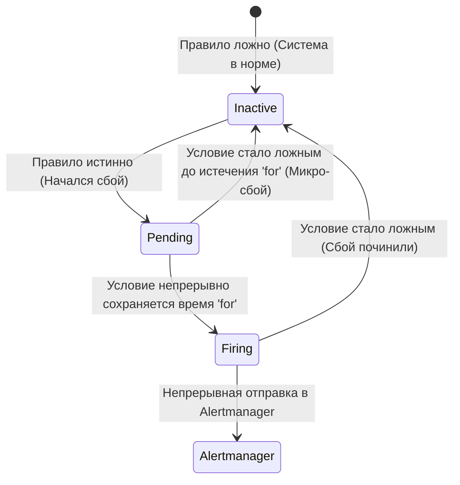

# Лабораторная работа 17: Метрики и алертинг (Prometheus + Grafana + Alertmanager)

## Оглавление
<!-- TOC -->
- [Предварительные требования](#предварительные-требования)
- [Стартовая проверка](#стартовая-проверка)
- [Введение: Observability и мониторинг](#введение-observability-и-мониторинг)
- [Часть 1: Установка kube-prometheus-stack](#часть-1-установка-kube-prometheus-stack)
  - [Теория для изучения перед частью](#теория-для-изучения-перед-частью)
  - [1.1 Установка через Helm](#11-установка-через-helm)
  - [1.2 Архитектура Prometheus Operator](#12-архитектура-prometheus-operator)
- [Часть 2: PromQL и типы метрик](#часть-2-promql-и-типы-метрик)
  - [Теория: Типы метрик](#теория-типы-метрик)
  - [Теория: Векторы, функции и кардинальность](#теория-векторы-функции-и-кардинальность)
  - [2.1 Практика: Запросы PromQL](#21-практика-запросы-promql)
- [Часть 3: ServiceMonitor — подключение своего приложения](#часть-3-servicemonitor--подключение-своего-приложения)
  - [Теория: Как работает Service Discovery в k8s](#теория-как-работает-service-discovery-в-k8s)
  - [3.1 Практика: Деплой приложения и ServiceMonitor](#31-практика-деплой-приложения-и-servicemonitor)
- [Часть 4: Grafana и Alertmanager](#часть-4-grafana-и-alertmanager)
  - [Теория: Дашборды и жизненный цикл алерта](#теория-дашборды-и-жизненный-цикл-алерта)
  - [4.1 Практика: Grafana](#41-практика-grafana)
  - [4.2 Практика: Создание и триггер алерта](#42-практика-создание-и-триггер-алерта)
- [Часть 5: Troubleshooting (Решение проблем)](#часть-5-troubleshooting-решение-проблем)
  - [Инцидент 1: Таргет не появляется (ServiceMonitor без `release` label)](#инцидент-1-таргет-не-появляется-servicemonitor-без-release-label)
  - [Инцидент 2: Таргет есть, но `up == 0` (NetworkPolicy блокирует scrape)](#инцидент-2-таргет-есть-но-up--0-networkpolicy-блокирует-scrape)
  - [Инцидент 3: Несовпадение портов в Service и ServiceMonitor](#инцидент-3-несовпадение-портов-в-service-и-servicemonitor)
  - [Инцидент 4: Prometheus OOMKilled (Взрыв кардинальности)](#инцидент-4-prometheus-oomkilled-взрыв-кардинальности)
  - [Инцидент 5: Алерт не доходит до получателя (Проблемы маршрутизации Alertmanager)](#инцидент-5-алерт-не-доходит-до-получателя-проблемы-маршрутизации-alertmanager)
- [Проверка модуля](#проверка-модуля)
- [Финальная карта ресурсов модуля](#финальная-карта-ресурсов-модуля)
- [Теоретические вопросы (итоговые)](#теоретические-вопросы-итоговые)
- [Практические задания (отработка)](#практические-задания-отработка)
- [Шпаргалка](#шпаргалка)
- [Чему вы научились](#чему-вы-научились)
- [Уборка](#уборка)
<!-- /TOC -->


> ⏱ время ~60-90 мин · сложность 4/5 · пререквизиты: Трек 1 (Core)

Цель: поднять полноценный observability-стек и научиться им пользоваться на глубоком уровне — 
собирать метрики (Prometheus), писать сложные запросы (PromQL), визуализировать данные 
(Grafana), подключать свои приложения (ServiceMonitor), а также настраивать алерты и 
маршрутизировать их (PrometheusRule + Alertmanager). Это логическое и масштабное развитие модуля 08 (там был только `kubectl top` и metrics-server) до production-ready стека с историей, алертами и кастомными метриками.

---

## Предварительные требования

Для прохождения данного модуля вам потребуется развернутый кластер Kubernetes и настроенный доступ через `kubectl`.

```bash
# Убедитесь, что переменная KUBECONFIG указывает на верный кластер.
# Для нашего стенда Kubespray:
export KUBECONFIG=/root/.kube/kubespray.conf

# Проверяем наличие Helm (он потребуется для установки kube-prometheus-stack)
helm version --short

# Проверяем, что рабочие ноды доступны и имеют достаточно ресурсов
# (Весь стек Prometheus может потреблять 1-2 ГБ оперативной памяти)
kubectl get nodes
```

## Стартовая проверка

Перед началом убедитесь, что кластер функционирует нормально:

```bash
kubectl get nodes
kubectl get pods -A
```
Все поды системных компонентов (`kube-system`) должны быть в статусе `Running`.

---

## Введение: Observability и мониторинг

Прежде чем устанавливать инструменты, важно понять **почему** мы используем именно их и какие задачи они решают.
В современном cloud-native мире и микросервисной архитектуре выделяют три основных столпа наблюдаемости (Observability):

1. **Метрики (Metrics)** — количественные показатели системы (счетчики, датчики, гистограммы), агрегированные за промежуток времени. Они отвечают на вопрос **"Что происходит?"** (например: использование CPU достигло 95%, количество ошибок 500 возросло в 3 раза). Метрики идеальны для алертинга, так как они легкие и их можно хранить месяцами.
2. **Логи (Logs)** — текстовые записи о конкретных дискретных событиях в системе. Отвечают на вопрос **"Почему это происходит?"** (например: в логах базы данных видно сообщение "Connection refused").
3. **Трейсы (Traces)** — путь прохождения единичного запроса через распределенную цепочку микросервисов. Отвечают на вопрос **"Где именно происходит задержка или ошибка?"** (например: Frontend отработал быстро, а микросервис оплаты ждал ответа от биллинга 5 секунд).

В этом модуле мы фокусируемся исключительно на первом столпе — **Метриках**. 
Для Kubernetes мировым стандартом де-факто стал **Prometheus**. Он был изначально спроектирован инженерами SoundCloud для динамических сред, где приложения, сервера и поды постоянно создаются, масштабируются и удаляются. Традиционные системы мониторинга (типа Zabbix или Nagios), требующие статических списков IP-адресов серверов, с такой динамикой справляются очень плохо.

---

## Часть 1: Установка kube-prometheus-stack

### Теория для изучения перед частью

- **Prometheus** работает по **pull-модели**: он сам ходит по сети и собирает (scrape) данные по HTTP с endpoint-ов `/metrics` целевых сервисов с определенной периодичностью (scrape interval, по умолчанию 15-30 секунд). Он сохраняет эти данные в своей локальной высокопроизводительной Time Series Database (TSDB) и отвечает на запросы через собственный функциональный язык запросов — PromQL. В отличие от `metrics-server`, который предоставляет только текущие (snapshot) значения CPU/RAM исключительно для автоскейлинга (HPA), Prometheus хранит **историю**, позволяет строить графики за прошедшие месяцы и алертить по сложным математическим трендам.

- **kube-prometheus-stack** — это комплексный Helm-чарт, поддерживаемый комьюнити, который устанавливает сразу весь необходимый фундамент мониторинга "из коробки":
  - **Prometheus** (ядро сбора метрик и хранилище TSDB).
  - **Grafana** (веб-интерфейс для визуализации данных и построения дашбордов).
  - **Alertmanager** (компонент для группировки, дедупликации и маршрутизации алертов в мессенджеры/почту).
  - **node-exporter** (DaemonSet, который запускается на каждой ноде и транслирует метрики операционной системы — CPU, RAM, диск, сеть — в формат Prometheus).
  - **kube-state-metrics** (Deployment, который слушает Kubernetes API и транслирует состояние объектов k8s — сколько реплик у Deployment, в каком статусе Pods — в метрики).
  - **prometheus-operator** (умный контроллер, который управляет всем этим стеком через Kubernetes CRD, автоматизируя реконфигурацию).

**Pull vs push: Почему Prometheus выбрал Pull-модель?**

Архитектурный спор о том, кто должен инициировать передачу данных, существует давно. 

| Характеристика | Pull (Prometheus) | Push (StatsD / Graphite / Telegraf) |
|---|---|---|
| **Кто инициирует сбор?** | Prometheus САМ ходит на HTTP-эндпоинт `/metrics` | Приложение само активно ШЛЁТ данные в коллектор по UDP/TCP |
| **Где хранится список целей?** | В Prometheus (получает динамически через Service Discovery k8s API) | В приложении (каждое приложение должно знать адрес коллектора и аутентифицироваться) |
| **Определение живости (Liveness)** | Бесплатно. Если скрейп упал (timeout), генерируется системная метрика `up=0` | Сложно. Если нет данных — приложение зависло, упало, или на него просто нет пользовательской нагрузки? |
| **Контроль нагрузки** | Prometheus сам решает, как часто собирать данные (scrape interval), предотвращая перегрузку хранилища. | Приложения во время всплеска нагрузки могут сгенерировать шквал метрик и заDDOSить коллектор метриками. |
| **Сфера применения** | Долгоживущие сервисы (HTTP-серверы, базы данных, брокеры сообщений) | Короткоживущие скрипты, cron-джобы (в мире Prometheus они шлют данные в промежуточный кэш Pushgateway) |

### 1.1 Установка через Helm

Установим весь стек в выделенный namespace `monitoring`:

```bash
# Добавляем официальный репозиторий Helm для Prometheus-комьюнити
helm repo add prometheus-community https://prometheus-community.github.io/helm-charts
helm repo update

# Устанавливаем стек. 
# ВАЖНО: Имя релиза (в нашем случае 'kps') будет использоваться во множестве конфигураций и селекторов!
helm install kps prometheus-community/kube-prometheus-stack \
  -n monitoring --create-namespace --wait
```

Ожидаем завершения установки (это может занять пару минут). После завершения проверим созданные ресурсы:

```bash
kubectl -n monitoring get pods
```

Ожидаемый вывод должен выглядеть примерно так:
```text
NAME                                                     READY   STATUS    RESTARTS   AGE
alertmanager-kps-kube-prometheus-stack-alertmanager-0    2/2     Running   0          2m
kps-grafana-xxxxxxxxxx-yyyyy                             3/3     Running   0          2m
kps-kube-prometheus-stack-operator-xxxxxxxxxx-yyyyy      1/1     Running   0          2m
kps-kube-state-metrics-xxxxxxxxxx-yyyyy                  1/1     Running   0          2m
kps-prometheus-node-exporter-xxxxx                       1/1     Running   0          2m (будет по одному поду на каждую ноду)
prometheus-kps-kube-prometheus-stack-prometheus-0        2/2     Running   0          2m
```
*Обратите внимание: сам Prometheus и Alertmanager разворачиваются как StatefulSet (имеют индекс -0 на конце), так как им требуется персистентное хранилище для данных (PV/PVC), чтобы при рестарте пода не пропала история.*

### 1.2 Архитектура Prometheus Operator

Исторически, до появления операторов, конфигурация Prometheus хранилась в огромном статичном конфигурационном файле `prometheus.yml`. В Kubernetes поды и сервисы эфемерны — они постоянно появляются и исчезают, у них меняются IP-адреса. Править текстовый файл вручную стало невозможно. 
**Prometheus Operator** решает эту проблему в стиле Kubernetes-native: мы создаем декларативные манифесты (CRD), а оператор (работающий как контроллер) сам "переводит" их в `prometheus.yml` и на лету перезагружает конфигурацию Prometheus.

**Основные Custom Resource Definitions (CRD), которые приносит в кластер оператор:**
```bash
kubectl get crd | grep coreos.com
```
Вы увидите:
- `podmonitors.monitoring.coreos.com` — указывает Prometheus, какие поды напрямую скрейпить.
- `servicemonitors.monitoring.coreos.com` — указывает Prometheus, какие Service скрейпить (наиболее популярный метод).
- `prometheusrules.monitoring.coreos.com` — содержит правила алертинга и предварительной агрегации (recording rules).
- `alertmanagerconfigs.monitoring.coreos.com` — настройки маршрутизации алертов (кому отправлять в Slack, кому на Email).

**Архитектура потока данных (визуализация):**

```mermaid
graph TD
    %% Узлы сбора данных
    NE[node-exporter<br/>Метрики железа (CPU, RAM)] -->|Scrape /metrics| Prom(Prometheus Server<br/>TSDB & PromQL Engine)
    KSM[kube-state-metrics<br/>Состояние объектов k8s] -->|Scrape /metrics| Prom
    App[Ваше приложение<br/>Бизнес-метрики] -->|Scrape /metrics| Prom
    
    %% Управление оператором
    SM[ServiceMonitor CRD] -.->|Управляет конфигом скрейпа| PO[Prometheus Operator]
    PR[PrometheusRule CRD] -.->|Управляет правилами алертинга| PO
    PO -.->|Перезагружает конфигурацию| Prom
    
    %% Потребление данных
    Prom -->|Оценка правил & Триггер| Prom
    Prom -->|Отправка Firing Alerts| AM[Alertmanager]
    AM -->|Группировка & Маршрутизация| Slack[Slack / Telegram / Email / PagerDuty]
    Graf[Grafana] -->|Выполнение PromQL запросов| Prom
```

**Контрольные вопросы (Часть 1):**
1. В чем главное концептуальное преимущество Pull-модели перед Push в условиях эфемерной среды Kubernetes?
2. Какие два компонента из установленного стека отвечают исключительно за базовый мониторинг инфраструктуры (железа нод и самих объектов k8s)?
3. Какую проблему решает паттерн Operator в контексте конфигурации Prometheus?
4. Почему Prometheus и Alertmanager разворачиваются через `StatefulSet`, а не `Deployment`?

---

## Часть 2: PromQL и типы метрик

### Теория: Типы метрик

Если вы сделаете `curl` на любой endpoint `/metrics` приложения, которое инструментировано библиотеками Prometheus, вы увидите сырой текстовый формат, готовый к парсингу. 

```text
# HELP http_requests_total The total number of HTTP requests.
# TYPE http_requests_total counter
http_requests_total{method="post",status="200"} 1027
http_requests_total{method="post",status="500"} 15
```

Prometheus поддерживает 4 основных типа метрик:

1. **Counter (Счетчик)**
   Только растет вверх (или сбрасывается в 0 при рестарте процесса). 
   - *Примеры:* количество HTTP-запросов, переданных байт, количество возникших ошибок. 
   - *Важно:* Counter **НИКОГДА** не рисуется на графике напрямую. Линия, уходящая вечно вверх, неинформативна. Counter всегда используется с функциями вычисления производной (скорости изменения): `rate()` или `increase()`.

2. **Gauge (Датчик / Уровень)**
   Значение, которое может произвольно расти и падать со временем.
   - *Примеры:* текущее использование оперативной памяти, температура CPU, количество активных веб-сокет соединений, размер очереди сообщений. 
   - *Важно:* Gauge рисуется на графиках напрямую или усредняется функциями вроде `avg()`, `max()`. К нему **НЕЛЬЗЯ** применять `rate()`.

3. **Histogram (Гистограмма)**
   Измеряет распределение наблюдений (например, длительность запросов) и раскидывает их по заранее заданным корзинам (buckets). Это позволяет на стороне Prometheus вычислять любые перцентили (например, "99% запросов завершились быстрее, чем за 50мс").
   - *Примеры:* время ответа API (`http_request_duration_seconds_bucket`).
   - *Важно:* Всегда используется в связке с функцией `histogram_quantile(0.99, ...)` для построения графиков перцентилей. Очень "прожорливый" тип метрик по потреблению памяти.

4. **Summary (Сводка)**
   Похоже на Histogram, но перцентили жестко вычисляются на стороне самого приложения. Prometheus получает уже готовые значения (например, ровно p95). Это экономит ресурсы Prometheus, но делает невозможным агрегацию этих перцентилей с нескольких серверов (перцентиль от перцентилей математически некорректен).

### Теория: Векторы, функции и кардинальность

**Instant Vector vs Range Vector**

Понимание векторов — это фундамент написания любых запросов на PromQL (Prometheus Query Language).

- **Instant vector** (Мгновенный вектор): Набор временных рядов, каждый из которых содержит **ровно одно** значение в заданный момент времени.
  - *Пример запроса:* `up` или `node_memory_MemAvailable_bytes`.
  - Эти данные можно напрямую отрендерить на графике, потому что для каждой точки на оси X есть ровно одно значение по оси Y.

- **Range vector** (Вектор диапазона): Набор временных рядов, содержащих **массив значений** за указанный промежуток времени. Обозначается квадратными скобками, например `[5m]`.
  - *Пример запроса:* `http_requests_total[5m]` (вернет все точки счетчика запросов, которые Prometheus успел собрать за последние 5 минут).
  - Напрямую построить график по range vector **НЕЛЬЗЯ** (на оси Y для одного момента времени оказалось бы множество точек). Его обязательно нужно обернуть в функцию агрегации, которая "свернет" массив в одно число (например, вычислит скорость).

**Сглаживание против резкости: rate() vs irate()**

Обе функции применяются к `Counter` и вычисляют скорость роста (в секунду) за временное окно:
- `rate(metric[5m])` берет все точки в 5-минутном окне, вычисляет общий тренд, игнорирует случайные провалы и усредняет всплески. Идеально подходит для **алертов** (чтобы они не мигали) и красивых обзорных графиков.
- `irate(metric[5m])` игнорирует окно и берет только **две самые последние точки** в конце этого окна. Максимально чутко и резко реагирует на любые миллисекундные всплески. Идеально для ручного **дебага** и траблшутинга (чтобы увидеть узкий спайк нагрузки), но категорически запрещено для алертов — даст море ложных срабатываний.

*Правило окна:* Длина окна в квадратных скобках `[1m]` должна быть минимум в 4 раза больше интервала скрейпа. Если Prometheus ходит за метриками раз в 30 секунд, минимальное адекватное окно — `[2m]`. Иначе `rate` начнет "промахиваться" мимо точек и показывать нулевые провалы на графиках.

**Главный враг Prometheus: Кардинальность (Cardinality)**

Кардинальность — это самая частая причина падения Prometheus с ошибкой OOMKilled в продакшене.
**Кардинальность = общее число уникальных временных рядов в системе.** 

В Prometheus каждая новая комбинация имени метрики и всех её лейблов (key-value) порождает **отдельный** временной ряд, который держится в оперативной памяти (в так называемом head block).

Представьте, что разработчик добавил в метрику лейбл с ID пользователя:
`http_requests_total{method="GET", user_id="12345", endpoint="/profile"}`

Если на сайт зайдет 1 миллион уникальных пользователей, Prometheus моментально создаст 1 000 000 новых временных рядов в оперативной памяти. Это называется "Взрыв кардинальности" (Cardinality Explosion). Память закончится за считанные минуты, и процесс будет убит ядром Linux (OOMKilled).

**Золотое правило мониторинга:** Никогда не используйте в лейблах неограниченные, высоко-энтропийные значения (`user_id`, `email`, точный `URL` с параметрами запроса, `session_token`). Оставляйте только строгие словари с ограниченным перечнем значений (`status_code`, `method`, `route_name`).


### 2.1 Практика: Запросы PromQL

Сделаем проброс портов к веб-интерфейсу встроенного Prometheus, чтобы выполнить запросы вручную:

```bash
kubectl -n monitoring port-forward svc/kps-kube-prometheus-stack-prometheus 9090:9090 &
```
Откройте в браузере `http://localhost:9090`. Перейдите на вкладку **Graph**, введите запросы ниже и нажимайте `Execute` (используйте вкладки Table и Graph для визуализации).

1. **Список всех скрейп-таргетов и их живость (Instant Vector):**
   ```promql
   up
   ```
   *Вернет список всех наблюдаемых целей. Значение 1 означает "цель достижима и возвращает метрики", 0 означает "ошибка подключения или таймаут".*

2. **Запрос системной памяти нод (Gauge):**
   ```promql
   # Свободная память на нодах в мегабайтах
   node_memory_MemAvailable_bytes / 1024 / 1024
   ```

3. **Скорость сетевого трафика (Связка Counter + rate):**
   ```promql
   # Сумма принимаемых байт в секунду по всем сетевым интерфейсам, сгруппированная по конкретным нодам (instance)
   sum by (instance) (rate(node_network_receive_bytes_total[2m]))
   ```

4. **Гистограмма: 95-й перцентиль времени ответа Kubelet:**
   ```promql
   # Сложный, но очень классический запрос. histogram_quantile вычисляет перцентиль на основе бакетов (_bucket).
   histogram_quantile(0.95, sum by (le) (rate(kubelet_http_requests_duration_seconds_bucket[5m])))
   ```

5. **Статусы подов из kube-state-metrics:**
   ```promql
   # Показывает, сколько подов находится в статусе Failed или Pending. Идеально для алерта!
   sum by (namespace) (kube_pod_status_phase{phase=~"Failed|Pending"})
   ```

Остановим port-forward, вернув процесс из фона и прервав его:
```bash
kill %1 2>/dev/null
```

**Контрольные вопросы (Часть 2):**
1. В чем отличие `rate` от `irate` и в каких случаях применяется каждая из функций?
2. Почему попытка построить график простым запросом `http_requests_total[5m]` приведет к ошибке интерфейса?
3. Что такое "взрыв кардинальности" метрик и почему лейбл `client_ip="192.168.1.10"` в метрике — крайне плохая идея?

---

## Часть 3: ServiceMonitor — подключение своего приложения

### Теория: Как работает Service Discovery в k8s

Чтобы Prometheus начал собирать метрики с вашего бизнес-приложения, ему нужно знать, по каким IP-адресам к нему ходить. В классическом системном администрировании мы бы прописали статические IP в конфиг. В Kubernetes адреса подов постоянно меняются. 
Для решения этой проблемы оператор предоставляет декларативные CRD: **ServiceMonitor** или **PodMonitor**.

**Цепочка связывания (Service Discovery Chain):**
Это самое важное знание для траблшутинга. Каждое звено в Kubernetes связывается через метки (labels) и селекторы (selectors). Ошибка в одной букве — и метрик не будет.

```yaml
# Звено 1: Ваш Pod. Имеет метку app: metrics-app и слушает порт 8080.
metadata:
  labels:
    app: metrics-app

# Звено 2: Service. Ищет поды по метке app: metrics-app и дает порту ИМЯ "metrics".
spec:
  selector:
    app: metrics-app
  ports:
  - name: metrics  # КРИТИЧНО: ServiceMonitor цепляется за ИМЯ порта, а не за цифру 8080!
    port: 8080

# Звено 3: ServiceMonitor. 
# Ищет Service-ы по метке app: metrics-app и указывает Prometheus стучаться на endpoint порта "metrics".
spec:
  selector:
    matchLabels:
      app: metrics-app
  endpoints:
  - port: metrics

# Звено 4: Prometheus Operator.
# Оператор постоянно сканирует кластер. Он ищет ServiceMonitor-ы ТОЛЬКО с меткой release: kps 
# (где kps — имя нашего helm-релиза). Если у ServiceMonitor нет этой метки, он будет жестко проигнорирован.
```

### 3.1 Практика: Деплой приложения и ServiceMonitor

В директории `manifests/` находятся манифесты нашего тестового приложения. Давайте развернем его.

Сначала применим само приложение (Deployment и Service):
```bash
kubectl -n lab apply -f manifests/app.yaml
kubectl -n lab rollout status deploy/metrics-app --timeout=120s
```

Затем применим конфигурацию для мониторинга (ServiceMonitor и Alerting Rules):
```bash
kubectl -n lab apply -f manifests/servicemonitor.yaml
kubectl -n lab apply -f manifests/prometheusrule.yaml
```

Давайте заглянем внутрь `servicemonitor.yaml`, чтобы закрепить теорию:
```bash
cat manifests/servicemonitor.yaml
```
*Ключевые моменты, на которые стоит обратить внимание в выводе:*
- Лейбл `release: kps` в секции `metadata.labels` обязателен. Именно по нему Operator поймет, что этот манифест предназначается для его экземпляра Prometheus.
- `selector.matchLabels` четко указывает на `app: metrics-app`.
- В секции `endpoints` указано `port: metrics` (обращение по строковому имени, определенному в Service).

Проверим, подхватил ли Prometheus новый таргет:
```bash
kubectl -n monitoring port-forward svc/kps-kube-prometheus-stack-prometheus 9090:9090 &
sleep 3
# Запросим статус таргетов через HTTP API Prometheus
curl -s 'http://localhost:9090/api/v1/targets' | grep metrics-app
```
Если архитектура отработала верно, в браузере по адресу `http://localhost:9090/targets` вы увидите новый блок. В нем будет таргет `serviceMonitor/lab/metrics-app/0` со статусом зеленого цвета **UP**. Это означает, что Prometheus успешно дошел до вашего приложения и скачал метрики.

Остановите port-forward:
```bash
kill %1 2>/dev/null
```

**Контрольные вопросы (Часть 3):**
1. Через какое свойство (порт) ServiceMonitor ссылается на Service? (Номер порта `8080` или строковое имя `metrics`?)
2. Почему ваш ServiceMonitor обязательно должен иметь метку `release: kps` (или ту, что вы задали при Helm install)? Что произойдет, если вы забудете её указать?
3. В чем разница между `PodMonitor` и `ServiceMonitor`?

---

## Часть 4: Grafana и Alertmanager

### Теория: Дашборды и жизненный цикл алерта

**Grafana** сама по себе не хранит никаких метрик. Она выступает исключительно в роли красивого интерфейса (UI). При загрузке дашборда она отправляет PromQL-запросы к подключенным Data Sources (источникам данных, в нашем случае — Prometheus), получает массивы чисел и строит по ним графики. 
Helm-чарт `kube-prometheus-stack` мощнейшим образом экономит наше время: он автоматически устанавливает и настраивает огромный набор готовых (provisioned) дашбордов для мониторинга узлов, подов, API-сервера и сети Kubernetes "из коробки".

**Alertmanager** — это самостоятельный компонент, работающий отдельно от Prometheus. 
Сам Prometheus лишь вычисляет математические правила каждую минуту. Если PromQL-условие срабатывает, Prometheus отправляет короткий сырой сигнал (Firing) в Alertmanager.
Задачи Alertmanager:
- **Grouping (Группировка):** Если упала стойка в датацентре, и 100 подов перестали отвечать, Alertmanager соберет 100 похожих микро-алертов в 1 сводное сообщение в Slack, спасая вас от шторма уведомлений.
- **Inhibition (Подавление / Ингибирование):** Если упала сеть на ноде (алерт NodeDown), нет смысла присылать еще 50 алертов об упавших на ней базах данных. Alertmanager подавляет зависимые алерты.
- **Silencing (Заглушки):** Позволяет дежурному инженеру через UI временно заглушить алерты (например, "Не беспокоить алертами базы данных до 6 утра, идут техработы").
- **Routing (Маршрутизация):** Позволяет настроить разные пути отправки. Например, алерты с меткой `severity="critical"` отправлять в PagerDuty (звонок админу ночью), а `severity="warning"` — тихо складывать в канал Telegram или Jira.

**Жизненный цикл алерта в Prometheus:**



Зачем нужно поле `for` в правилах?
Оно защищает от "дребезга" (flapping). В облаке сеть может моргнуть на 5 секунд, или под может быстро перезапуститься. Мы не хотим будить админа из-за кратковременной микро-ошибки. Указание `for: 1m` (или `for: 5m`) дает гарантию, что алерт выстрелит, **только** если проблема стабильна и не уходит минимум 1 минуту.

### 4.1 Практика: Grafana

Зайдем в интерфейс Grafana, чтобы посмотреть предустановленные дашборды:
```bash
kubectl -n monitoring port-forward svc/kps-grafana 3000:80 &
```
1. Откройте браузер по адресу `http://localhost:3000`.
2. Введите учетные данные по умолчанию. Логин: `admin`, Пароль: `prom-operator` (это пароль по умолчанию из чарта).
3. В левом меню нажмите на лупу (Dashboards) и перейдите в папку `General` -> `Kubernetes / Compute Resources / Cluster`.
Вы увидите детальную, агрегированную статистику потребления CPU, памяти, пропускной способности сети всего кластера с разбивкой по пространствам имен и отдельным подам.
Это прямая, production-ready замена примитивному `kubectl top`.

Остановим port-forward:
```bash
kill %1 2>/dev/null
```

### 4.2 Практика: Создание и триггер алерта

Ранее мы применили файл `manifests/prometheusrule.yaml`. Давайте посмотрим, что внутри:
```bash
cat manifests/prometheusrule.yaml
```
Там описано правило алертинга `MetricsAppDown`:
```yaml
spec:
  groups:
  - name: metrics-app.rules
    rules:
    - alert: MetricsAppDown
      expr: up{job="metrics-app"} == 0
      for: 1m
      labels:
        severity: critical
      annotations:
        summary: "Metrics App is down"
```

Давайте искусственно спровоцируем этот алерт! Уроним наше приложение, отмасштабировав его в 0 реплик:
```bash
kubectl -n lab scale deploy metrics-app --replicas=0
```

Проверим, как Prometheus реагирует на инцидент. Пробросим порт снова:
```bash
kubectl -n monitoring port-forward svc/kps-kube-prometheus-stack-prometheus 9090:9090 &
```
Откройте в браузере `http://localhost:9090/alerts`.
Вы сможете наблюдать жизненный цикл своими глазами:
1. Почти сразу алерт `MetricsAppDown` появится в списке и будет желтым в состоянии **PENDING**. Условие сработало, но Prometheus ждет.
2. Ровно через 1 минуту стабильного ожидания (`for: 1m`), состояние изменится на красный **FIRING**. С этого момента он активно передается в Alertmanager.

Если бы у нас был настроен Slack Webhook в конфиге Alertmanager, вам бы уже пришло сообщение.

Вернем приложение к жизни:
```bash
kubectl -n lab scale deploy metrics-app --replicas=1
kill %1 2>/dev/null
```
Буквально через 30-40 секунд алерт пропадет из статуса FIRING и вернется в Inactive.

**Контрольные вопросы (Часть 4):**
1. В каком компоненте стека настраиваются правила группировки алертов и получатели (Slack vs Email)?
2. Почему алерт не становится FIRING мгновенно, а сначала проходит транзитную стадию PENDING?
3. Что произойдет, если во время стадии PENDING условие (`expr`) хотя бы на одну секунду станет ложным (например, под кратковременно ответит)? Отсчет времени `for` продолжится или сбросится?

---

## Часть 5: Troubleshooting (Решение проблем)

При работе с Prometheus Operator инженеры практически каждый день сталкиваются с одними и теми же архитектурными проблемами связности. Разберем Топ-5 классических инцидентов и способы их лечения.

### Инцидент 1: Таргет не появляется (ServiceMonitor без `release` label)

**Симптом:** Вы написали и применили CRD `ServiceMonitor`. Но в Prometheus UI на вкладке `Status -> Targets` его нет вообще. Он даже не отображается красным, он просто не существует.
**Причина:** Prometheus Operator ищет ServiceMonitor-ы строго по лейблу, указанному при установке самого стека (обычно это лейбл релиза Helm, например `release: kps`). Если на вашем CRD нет этого лейбла, оператор его просто игнорирует, считая, что этот манифест принадлежит какому-то другому Prometheus в кластере.
**Диагностика:**
```bash
kubectl get servicemonitor metrics-app -n lab --show-labels
```
**Лечение:**
Добавить требуемый лейбл в манифест или напрямую:
```bash
kubectl -n lab label servicemonitor metrics-app release=kps
```

### Инцидент 2: Таргет есть, но `up == 0` (NetworkPolicy блокирует scrape)

**Симптом:** Ваш таргет появился во вкладке Targets, но он горит красным. Состояние `DOWN`, `up{job="metrics-app"} == 0`, а в столбце `Error` написано `context deadline exceeded` или `connection refused`. При этом само бизнес-приложение работает и отвечает на запросы пользователей.
**Причина:** Сетевая изоляция. В кластере включен плагин CNI с поддержкой NetworkPolicy (например, Calico), и в неймспейсе приложения настроена политика `default-deny`. Prometheus физически пытается достучаться из своего неймспейса `monitoring`, но приложение молча отбрасывает (Drop) TCP трафик.
**Лечение:** Разрешить Ingress-трафик на порты метрик от подов Prometheus:
```yaml
apiVersion: networking.k8s.io/v1
kind: NetworkPolicy
metadata:
  name: allow-prometheus-scrape
  namespace: lab
spec:
  podSelector:
    matchLabels:
      app: metrics-app
  policyTypes:
  - Ingress
  ingress:
  - from:
    - namespaceSelector:
        matchLabels:
          kubernetes.io/metadata.name: monitoring
    ports:
    - protocol: TCP
      port: 8080
```

### Инцидент 3: Несовпадение портов в Service и ServiceMonitor

**Симптом:** ServiceMonitor имеет нужные лейблы, но таргет не появляется, или появляется с ошибкой `0/0 active targets` в панели оператора.
**Причина:** `ServiceMonitor` нацеливается на порт приложения по его **строковому имени** (name), а не по числовому значению. Если в манифесте `Service` порт назван `http`, а в `ServiceMonitor` вы ошиблись и указали `metrics` — связка (discovery) не произойдет.
**Лечение:** Проверьте глазами точное совпадение строковых имен:
```yaml
# В манифесте Service:
ports:
- name: web-metrics  <--- Имя тут
  port: 8080

# В манифесте ServiceMonitor:
endpoints:
- port: web-metrics  <--- Должно совпадать с именем тут
```

### Инцидент 4: Prometheus OOMKilled (Взрыв кардинальности)

**Симптом:** Под `prometheus-kps-kube-prometheus-stack-prometheus-0` работает 5 минут, затем потребление памяти уходит в потолок (зависит от лимитов, часто >4Gb), и под завершается ядром с ошибкой `OOMKilled`. Цикл повторяется.
**Причина:** Какое-то приложение начало экспортировать метрику с высоко-энтропийным лейблом (например, ID сессии пользователя, IP-адрес, или UUID). Количество рядов в памяти TSDB превысило допустимый лимит.
**Диагностика:** Если Prometheus успевает прожить хотя бы минуту, откройте `Prometheus UI -> Status -> TSDB Status`. В разделе `Top 10 label names with high memory usage` вы сразу увидите проблемную метрику с миллионами значений.
**Лечение:** 
*Быстрое (пожарное):* Заблокировать (сбросить) эту вредную метрику прямо на этапе сбора (scrape time) через механизм `metricRelabelings` в вашем `ServiceMonitor`:
```yaml
spec:
  endpoints:
  - port: metrics
    metricRelabelings:
    - sourceLabels: [__name__]
      regex: 'http_requests_with_user_id_total' # Имя вредной метрики
      action: drop
```
*Долгосрочное:* Вернуть таску разработчикам, чтобы они исправили код приложения и удалили динамический лейбл из инструментации.

### Инцидент 5: Алерт не доходит до получателя (Проблемы маршрутизации Alertmanager)

**Симптом:** Вы видите, что алерт стабильно горит красным `FIRING` в UI Prometheus, но в вашем Slack или Email тишина.
**Причина:** Проблема находится на стороне интеграций `Alertmanager`. Неверный Webhook URL, истекший токен доступа, или ошибка в дереве маршрутизации (алерт не попал ни в один route и был сброшен).
**Диагностика:** Сделайте Port Forward на интерфейс Alertmanager (порт 9093). Если алерт присутствует в его UI, значит связь Prometheus -> Alertmanager работает. Проблема в доставке Alertmanager -> Мессенджер. 
Смотрите логи пода Alertmanager:
```bash
kubectl -n monitoring logs statefulset/alertmanager-kps-kube-prometheus-stack-alertmanager -c alertmanager
```
Там вы увидите ошибки вида `context deadline exceeded` (закрыт выход в интернет к серверам Slack) или `403 Forbidden` (неверный токен).

**Контрольные вопросы (Часть 5):**
1. Как наличие строгого NetworkPolicy в кластере может сломать мониторинг, даже если все манифесты Prometheus написаны идеально? Как это починить?
2. Что такое "взрыв кардинальности"? С помощью какого поля в `ServiceMonitor` можно временно заблокировать (drop) сбор вредной метрики до исправления кода?
3. По какому полю (по номеру или по имени) связываются порты между манифестами Service и ServiceMonitor?

---

## Проверка модуля

Запустите скрипт автоматической проверки, чтобы убедиться, что всё настроено верно и ресурсы поднялись:

```bash
kubectl -n lab apply -f manifests/app.yaml
kubectl -n lab apply -f manifests/servicemonitor.yaml
kubectl -n lab rollout status deploy/metrics-app --timeout=120s

bash verify/verify.sh
```

Ожидаемый вывод:
```text
[OK] kube-prometheus-stack present (ns monitoring)
[OK] module 17 verified
```

Скрипт проверяет наличие пространства имен `lab`, успешную готовность подов `metrics-app`, валидное присутствие `ServiceMonitor/metrics-app` и наличие самого стека в пространстве `monitoring` (проверяет наличие подов prometheus).

---

## Финальная карта ресурсов модуля

Чтобы закрепить в памяти архитектуру, вот таблица соответствия ресурсов их бизнес-ролям в системе:

| Ресурс / Компонент | Роль в системе |
|--------|-------------------|
| `kube-prometheus-stack` (Helm) | Комплексный чарт-инсталлятор, устанавливающий всё нижеперечисленное разом |
| `Prometheus` | Ядро системы (надежный pull-скрейпер + хранилище TSDB + математический движок PromQL) |
| `Grafana` | Визуализатор данных из Prometheus. Позволяет строить дашборды. |
| `Alertmanager` | Группировщик, подавитель и маршрутизатор алертов в мессенджеры |
| `node-exporter` | Сборщик системных "железячных" метрик с Linux нод (загрузка CPU, I/O диска, трафик сети) |
| `kube-state-metrics` | Транслятор состояний API Kubernetes (количество реплик, статусы подов) в числовые метрики |
| `Prometheus Operator` | Kubernetes-контроллер, читающий CRD и генерирующий классический конфиг для Prometheus |
| `ServiceMonitor` (CRD) | Декларативное правило Service Discovery "Откуда и как собирать метрики" |
| `PrometheusRule` (CRD) | Декларативное математическое правило "При каком условии стрелять алертом" |

---

## Теоретические вопросы (итоговые)

1. Опишите фундаментальную разницу между Pull и Push моделями сбора метрик. Почему инженеры Kubernetes отдают безоговорочное предпочтение Pull-архитектуре?
2. Перечислите 4 основных типа метрик в формате Prometheus. Для чего применяется тип Histogram?
3. Объясните разницу между Instant Vector и Range Vector. Почему функция `rate()` математически требует на вход именно Range Vector?
4. Как конкретно `ServiceMonitor` находит ваше приложение? Опишите полную цепочку селекторов (от `ServiceMonitor` до Pod), включая обязательную роль метки релиза для Operator.
5. Что такое "кардинальность метрик"? Почему метка вида `request_path="/api/v1/users/12345/profile"` потенциально убьет ваш кластер по оперативной памяти?
6. Зачем алерту нужно поле `for`? Опишите, как меняются статусы алерта (Inactive, Pending, Firing) от момента нормальной работы системы до момента отправки сообщения.
7. Какие важные задачи решает `Alertmanager`, которые принципиально не решает сам движок Prometheus?

---

## Практические задания (отработка)

> Делайте эти задания на живом кластере. Они имитируют реальные рабочие задачи инженеров эксплуатации.

1. **Базовый PromQL:** Напишите PromQL запрос, который покажет текущее потребление памяти конкретным подом (используйте базовую метрику контейнера, например от `cadvisor` или `kubelet`).
2. **Изменение интервалов:** Измените манифест ServiceMonitor приложения `metrics-app`, чтобы он собирал метрики агрессивнее — раз в 10 секунд (добавьте поле `interval: 10s` в блок endpoints). Примените изменения и проверьте в Prometheus UI (вкладка Targets), что интервал действительно изменился.
3. **Борьба с кардинальностью:** Воспроизведите «взрыв кардинальности». Зайдите в код любого тестового приложения или используйте эмулятор метрик, добавив метрику со случайным UUID. Посмотрите, как резко растет потребление RAM подом Prometheus. Затем напишите правило `metricRelabelings` с действием `drop` в ServiceMonitor, чтобы остановить этот рост и срезать метрику "на подлете".
4. **Свой собственный алерт:** Создайте с нуля свое правило `PrometheusRule`. Оно должно алертить, если суммарное количество готовых реплик (`kube_deployment_status_replicas_ready`) вашего Deployment `metrics-app` становится строго меньше 2. Установите время защиты от дребезга `for: 2m`.
5. **Анализ kube-state-metrics:** Изучите метрики, которые предоставляет `kube-state-metrics`. Найдите, как с помощью одной метрики узнать, сколько раз конкретный контейнер в поде был перезапущен (`restarts`).
6. **Работа с Grafana:** Войдите в Grafana, создайте пустой дашборд с нуля (Add panel). Выведите на нем график скорости исходящего сетевого трафика на всех нодах, используя комбинацию функций `rate()` и агрегации `sum by(instance)`. Сделайте график красивым (задайте оси в байтах).

---

## Шпаргалка

```bash
# === Установка и обновление стека ===
helm repo update
helm upgrade kps prometheus-community/kube-prometheus-stack -n monitoring

# === Просмотр статусов компонентов ===
kubectl -n monitoring get pods,svc
kubectl -n monitoring get prometheus,alertmanager
kubectl get servicemonitor,prometheusrule -A

# === Доступ к UI через Port Forwarding ===
# 1. Интерфейс Prometheus (проверка запросов и таргетов)
kubectl -n monitoring port-forward svc/kps-kube-prometheus-stack-prometheus 9090:9090
# 2. Интерфейс Grafana (дашборды)
kubectl -n monitoring port-forward svc/kps-grafana 3000:80      # логин: admin, пароль: prom-operator
# 3. Интерфейс Alertmanager (проверка статуса отправки)
kubectl -n monitoring port-forward svc/kps-kube-prometheus-stack-alertmanager 9093:9093

# === Прямые запросы к API Prometheus (curl) ===
# Посмотреть список живых таргетов (JSON):
curl -s 'http://localhost:9090/api/v1/query?query=up' 
# Посмотреть статус всех правил алертинга:
curl -s 'http://localhost:9090/api/v1/rules'

# === Дебаг "Почему нет метрик?" ===
kubectl -n lab get servicemonitor metrics-app -o yaml
# Чек-лист проверки:
# 1. Совпадает ли `matchLabels` с метками, указанными в Service?
# 2. Совпадает ли строковое ИМЯ порта в `endpoints.port` с `name` порта в Service?
# 3. Присутствует ли лейбл оператора (например, `release: kps`) в секции `metadata.labels` самого ServiceMonitor?

# === Уборка (Деинсталляция) ===
kubectl -n lab delete -k manifests/
# Чтобы полностью удалить весь стек из кластера (Осторожно, удалит всю историю!):
# helm uninstall kps -n monitoring && kubectl delete ns monitoring
```

---

## Чему вы научились

В этом глубоком погружении вы прошли путь от понимания концепций до реальной настройки:
- Досконально разобрали архитектуру production-ready observability-стека на базе паттерна Prometheus Operator.
- Научились понимать различные типы метрик (Counter, Gauge, Histogram).
- Научились писать осмысленные и сложные запросы на языке PromQL, учитывая нюансы Range-векторов и функций агрегации (`rate`, `irate`).
- Осознали критическую проблему взрыва кардинальности метрик и научились её предотвращать на уровне конфигов.
- Успешно интегрировали собственные бизнес-приложения в контур сбора метрик через манифесты ServiceMonitor.
- Настроили автоматическое реагирование на сбои через связку PrometheusRule и Alertmanager, разобрав жизненный цикл алерта от зарождения (Pending) до отправки (Firing).
- Разобрали 5 реальных сценариев поломок систем мониторинга и освоили методики их быстрой диагностики и ремонта.

## Уборка

Чтобы освободить вычислительные ресурсы кластера:
```bash
# Удаляем тестовое приложение и его правила мониторинга
kubectl -n lab delete -k manifests/

# Если весь стек мониторинга вам больше не нужен и вы хотите освободить RAM нод:
# helm uninstall kps -n monitoring
# kubectl delete ns monitoring
```
