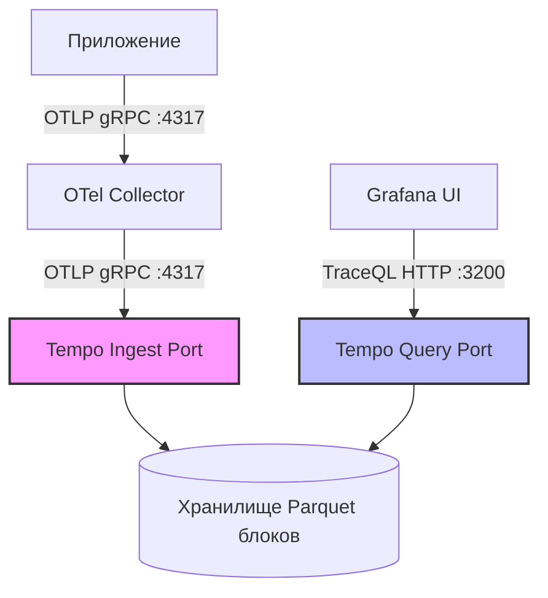

# Лабораторная работа 30: Распределённый трейсинг — OpenTelemetry, Tempo и корреляция с логами

## Оглавление
<!-- TOC -->
- [Введение](#введение)
- [Предварительные требования](#предварительные-требования)
- [Стартовая проверка](#стартовая-проверка)
- [Часть 1: Span, trace и первый трейс в Tempo](#часть-1-span-trace-и-первый-трейс-в-tempo)
  - [Теория для изучения перед частью](#теория-для-изучения-перед-частью)
  - [1.1 Деплой Tempo и синтетический трейс](#11-деплой-tempo-и-синтетический-трейс)
  - [1.2 Поиск: TraceQL через search API](#12-поиск-traceql-через-search-api)
- [Часть 2: OTel Collector — конвейер телеметрии](#часть-2-otel-collector--конвейер-телеметрии)
  - [Теория для изучения перед частью](#теория-для-изучения-перед-частью-1)
  - [2.1 Деплой коллектора и трафик через него](#21-деплой-коллектора-и-трафик-через-него)
  - [2.2 Анализ пайплайна: от приема до экспорта](#22-анализ-пайплайна-от-приема-до-экспорта)
- [Часть 3: Автоинструментация приложения и распределённый trace](#часть-3-автоинструментация-приложения-и-распределённый-trace)
  - [Теория для изучения перед частью](#теория-для-изучения-перед-частью-2)
  - [3.1 Деплой микросервисов и распределённый трейс](#31-деплой-микросервисов-и-распределённый-трейс)
  - [3.2 Разбор дерева спанов](#32-разбор-дерева-спанов)
  - [3.3 TraceQL: продвинутый поиск аномалий и ошибок](#33-traceql-продвинутый-поиск-аномалий-и-ошибок)
- [Часть 4: Grafana — единое окно: трейсы ↔ логи](#часть-4-grafana--единое-окно-трейсы--логи)
  - [Теория для изучения перед частью](#теория-для-изучения-перед-частью-3)
  - [4.1 Подключение datasource'ов и Provisioning](#41-подключение-datasourceов-и-provisioning)
  - [4.2 Корреляция в обе стороны (Логи ↔ Трейсы)](#42-корреляция-в-обе-стороны-логи--трейсы)
- [Часть 5: Troubleshooting (Диагностика отказов)](#часть-5-troubleshooting-диагностика-отказов)
  - [Дерево диагностики по симптому](#дерево-диагностики-по-симптому)
  - [Инцидент 1: Экспорт в query-порт (Трейсы пропали)](#инцидент-1-экспорт-в-query-порт-трейсы-пропали)
  - [Инцидент 2: Разорванный трейс (Потеря контекста W3C)](#инцидент-2-разорванный-трейс-потеря-контекста-w3c)
  - [Инцидент 3: OOMKill OTel Collector'а под нагрузкой](#инцидент-3-oomkill-otel-collectorа-под-нагрузкой)
  - [Инцидент 4: Ошибки автоинструментации (Crash приложения)](#инцидент-4-ошибки-автоинструментации-crash-приложения)
- [Проверка модуля](#проверка-модуля)
- [Финальная карта ресурсов модуля](#финальная-карта-ресурсов-модуля)
- [Теоретические вопросы (итоговые)](#теоретические-вопросы-итоговые)
- [Практические задания (отработка)](#практические-задания-отработка)
- [Шпаргалка](#шпаргалка)
- [Чему вы научились](#чему-вы-научились)
- [Уборка](#уборка)
<!-- /TOC -->

---

## Введение

> ⏱ время ~60 мин · сложность 4/5 · пререквизиты: модули 08, 17, 18

Цель этого модуля — достроить третий, завершающий сигнал наблюдаемости (Observability). 
- **Метрики** (модуль 17) отвечают на вопрос «ЧТО сломалось» (например, графики показывают всплеск 500-х ошибок).
- **Логи** (модуль 18) отвечают на вопрос «ПОЧЕМУ» это сломалось (текст исключения, stack trace).
- **Трейсы** (этот модуль) отвечают на вопросы «ГДЕ именно в длинной цепочке микросервисов это произошло», «какова была последовательность вызовов» и «куда ушло основное время обработки».

К концу модуля вы самостоятельно поднимете полный современный конвейер телеметрии: **Приложение (Python OTel SDK) → OTel Collector → Tempo → Grafana**. Вы научитесь читать распределённый trace, состоящий из множества спанов от разных сервисов, искать ошибки с помощью языка **TraceQL** и бесшовно связывать трейсы с логами Loki **в обе стороны** по `trace_id`.

**Почему распределенный трейсинг стал критически важным?** 
В монолитном приложении один бизнес-запрос обрабатывается в рамках одного процесса на одном сервере. Если происходит ошибка, стек-трейса в логах достаточно для понимания проблемы. В современной микросервисной архитектуре запрос пользователя (например, «оформить заказ») может породить веер асинхронных и синхронных вызовов к десяткам других сервисов (авторизация, склад, платежный шлюз, БД, кэш). Без распределенного трейсинга невозможно понять:
1. Какой именно микросервис в середине цепочки ответил 500-й ошибкой, из-за которой «упал» весь запрос?
2. Почему запрос выполнялся 3 секунды, если каждый отдельный сервис в своих логах пишет, что отработал за 50мс? Кто из баз данных, кэшей или сторонних API «тормозил»?
3. В какой последовательности происходили вызовы: параллельно или последовательно?

> Все «ожидаемые выводы» в командах ниже сняты на нашем эталонном Kubespray кластере (k8s **v1.36.1**):
> Версия Tempo **3.0.2**, OTel Collector contrib **0.153.0**, opentelemetry-python **1.42.1/0.63b1**. 
> Модуль 18 нашего курса называется «logs-tracing», но до сих пор трассировки там не было — она требовала сложного OTel-конвейера, который рассматривается только здесь. Этот модуль полностью закрывает долг и погружает в стандарт OpenTelemetry.

---

## Предварительные требования

Для успешного прохождения модуля необходимо убедиться, что кластер имеет достаточные ресурсы и настроенные системы (Grafana и Loki) для работы с логами и метриками. Мы будем интегрироваться с ними.

```bash
# Экспортируем kubeconfig нашего кластера (для Kubespray). 
# Если вы используете другой стенд (minikube, kind, managed k8s) — укажите свой путь/контекст.
export KUBECONFIG=/root/.kube/kubespray.conf

# Создаем namespace lab, если его еще нет. 
# Используем dry-run паттерн для идемпотентности.
kubectl create ns lab --dry-run=client -o yaml | kubectl apply -f -

# Нам критически нужны работающие стеки из модулей 17 и 18:
kubectl -n monitoring get deploy kps-grafana          # Grafana (из модуля 17)
kubectl -n lab get deploy loki                        # Loki    (из модуля 18)
kubectl -n lab get ds promtail                        # Promtail(из модуля 18)
```

> **Бюджет квоты и ресурсов.** 
> Этот модуль разворачивается в namespace `lab` рядом со стеком логирования (модуль 18) и жестко зажат под ResourceQuota (`requests.memory: 1Gi`, `limits.cpu: 2`). 
> Суммарно после деплоя всех компонентов модуля будет занято около `1820m/2` limits.cpu и `912Mi/1Gi` requests.memory. 
> Из-за таких плотных ограничений у всех Deployment'ов в этом модуле установлена `strategy: Recreate`. Surge-поды (дополнительные поды, создаваемые при стратегии RollingUpdate) в квоту уже не помещаются. Это не баг, а сознательный трейд-офф для работы в ограниченной среде (подробно механика квот и лимитов разбиралась в модуле 12). 
> Это означает, что при обновлениях `Deployment` старые поды будут сначала удалены (downtime), и лишь затем созданы новые. В production-средах всегда используйте RollingUpdate с достаточным запасом ресурсов.

---

## Стартовая проверка

Давайте убедимся, что компоненты, которые мы будем устанавливать в этом модуле, еще не запущены и не оставлены от предыдущих прогонов:

```bash
# Ожидаем ошибку NotFound или пустой вывод
kubectl -n lab get deploy tempo otel-collector 2>&1 | head -2
```

---

## Часть 1: Span, trace и первый трейс в Tempo

### Теория для изучения перед частью

#### Анатомия Трейсинга: Span и Trace
В основе любой системы трассировки лежат две фундаментальные концепции:
- **Span (Спан)** — это минимальная логическая единица работы. Примеры спанов: обработка входящего HTTP-запроса, выполнение SQL-инструкции к базе данных, обращение к внешнему API или даже просто замер времени выполнения сложного алгоритма в коде.
  - Каждый спан обязательно имеет: точное время начала (Start Time), длительность (Duration), статус (OK, Error) и набор ключевых атрибутов (Tags/Attributes в формате ключ-значение).
  - У каждого спана есть свой уникальный идентификатор — `span_id` (8 байт).
- **Trace (Трейс)** — это ориентированный ациклический граф (чаще всего дерево) взаимосвязанных спанов, которые объединены общим глобальным идентификатором `trace_id` (16 байт, 32 hex-символа). 
  - Родственные связи (кто кого вызвал) задаются через поле `parent_span_id`. 
  - Самый первый спан в цепочке, у которого нет родителя, называется `root span`. Именно с него начинается запрос пользователя.

#### W3C Trace Context
Как микросервис на Java понимает, что к нему пришел запрос, который является частью трейса, начатого микросервисом на Node.js?
Ответ — **W3C Trace Context**. Это мировой веб-стандарт передачи контекста трассировки. Контекст передается прозрачно через HTTP заголовки, главным из которых является `traceparent`.
- Строгий формат заголовка: `00-<trace_id>-<parent_span_id>-<flags>`
- Пример: `traceparent: 00-4bf92f3577b34da6a3ce929d0e0e4736-00f067aa0ba902b7-01`
Его автоматически генерирует для новых трейсов, подставляет во все исходящие HTTP-вызовы и читает из всех входящих запросов библиотека OpenTelemetry (OTel SDK). Если вы используете автоинструментацию, программисту даже не нужно знать о существовании этого заголовка.

#### OpenTelemetry и OTLP
- **OpenTelemetry (OTel)** — это проект CNCF (Cloud Native Computing Foundation), который объединил в себе конкурировавшие ранее проекты OpenTracing и OpenCensus. OTel стал де-факто стандартом индустрии для сбора телеметрии.
- **OTLP (OpenTelemetry Protocol)** — единый, универсальный и высокопроизводительный протокол доставки телеметрии. Он умеет передавать трейсы, метрики и логи в одном потоке. Обычно работает поверх gRPC (по умолчанию использует порт `:4317`) или поверх HTTP/Protobuf (порт `:4318`).

#### Архитектура Grafana Tempo
- **Tempo** — это бэкенд для хранения и поиска трейсов от компании Grafana Labs. Главная «фишка» Tempo, обеспечившая ему популярность, — это дешевизна эксплуатации. Он не строит огромных, тяжелых и прожорливых полнотекстовых индексов (в отличие от Elasticsearch в Jaeger). Tempo хранит данные бинарными блоками в колоночном формате Parquet прямо в S3-совместимом хранилище (или на локальном диске) и ищет по ним "brute-force" методами с помощью своего языка запросов **TraceQL**.
- У Tempo строго разделены порты по их функциональному назначению. **Это критически важно понимать для траблшутинга**:
  - **OTLP ingest** (`4317` gRPC / `4318` HTTP) — порты исключительно для приёма данных (записи спанов). Никаких ответов на поисковые запросы здесь нет.
  - **HTTP query API** (`3200`) — порт исключительно для поиска и чтения трейсов пользователями, API-клиентами или UI Grafana. 
  - Попытка отправить спаны в порт `3200` приведет к немедленным ошибкам формата, а попытка прочитать данные с `4317` — к отказу gRPC соединения.
- **Tempo 3.0 (Breaking Changes)**: В новой мажорной версии (которую мы используем) легаси-блоки конфигов (`ingester:`, `compactor:`) из туториалов для ветки 2.x **полностью удалены**. Это связано с масштабным переходом на новую архитектуру приема данных (ingest-архитектура v2). 
  Если вы скопируете конфиг из старой статьи в интернете, под Tempo гарантированно упадет в CrashLoopBackOff с логом:
  ```text
  failed parsing config: ... line 15: field ingester not found in type app.Config
  ```
  Для миграции существующих боевых конфигураций Grafana предоставляет встроенную CLI-утилиту: `tempo-cli migrate config`.



---

**Цель части 1:** Запустить Tempo в standalone режиме, убедиться, что он способен принимать спаны через OTLP напрямую, и научиться искать эти спаны с помощью нового языка TraceQL через HTTP search API.

**Ресурсы:** `manifests/tempo.yaml`, `extras/telemetrygen-direct.yaml`.

---

### 1.1 Деплой Tempo и синтетический трейс

Для начала мы запустим Tempo как standalone-компонент, чтобы проверить его работоспособность в чистом виде, без сторонних приложений.

```bash
# Применяем конфигурацию и деплоймент Tempo
kubectl apply -f manifests/tempo.yaml

# Дожидаемся успешного запуска Deployment'а:
kubectl -n lab rollout status deploy/tempo --timeout=120s

# Проверяем, что Tempo успешно стартовал и готов к работе без ошибок конфигурации:
kubectl -n lab logs deploy/tempo --tail=1 | head -1
# Ожидаемый вывод:
# level=info ... msg="Tempo started"

# Теперь отправим первый трейс. Мы используем CLI утилиту telemetrygen, 
# которая умеет генерировать и отправлять синтетические OTLP-данные напрямую в Tempo.
# Это позволяет исключить из уравнения баги кода приложений и проверить сам бэкенд.
kubectl create -f extras/telemetrygen-direct.yaml

# Ждем, пока Job успешно завершит отправку своих данных:
kubectl -n lab wait --for=condition=complete job/telemetrygen-direct --timeout=120s

# Смотрим статус выполнения джобы:
kubectl -n lab get job telemetrygen-direct
# Ожидаемый вывод:
# NAME                  STATUS     COMPLETIONS   DURATION
# telemetrygen-direct   Complete   1/1           16s
```

### 1.2 Поиск: TraceQL через search API

Теперь, когда в Tempo лежат сгенерированные синтетические трейсы, мы должны их найти. Grafana делает эти запросы "под капотом", но для дебага и автоматизации полезно уметь выполнять их напрямую через API.

В Tempo 3.0 единственным способом поиска является специальный язык **TraceQL**. Запрос должен передаваться в HTTP GET параметре `q`, и он обязательно должен быть закодирован (urlencode), иначе спецсимволы сломают URL.

```bash
# Мы хотим найти все трейсы, у которых имя сервиса (resource.service.name) равно "telemetrygen"
# Исходный запрос на TraceQL: {resource.service.name="telemetrygen"}
# В формате urlencode он выглядит так: %7Bresource.service.name%3D%22telemetrygen%22%7D

# Выполняем HTTP запрос к Query порту (:3200) из пода в кластере:
kubectl -n lab exec deploy/tempo -- wget -qO- \
  'http://localhost:3200/api/search?q=%7Bresource.service.name%3D%22telemetrygen%22%7D&limit=3' | python3 -m json.tool

# Ожидаемый вывод (фрагмент JSON ответа):
# {
#     "traces": [
#         {
#             "traceID": "23977a63e931c65ca0763e9b639b6fe0",
#             "rootServiceName": "telemetrygen",
#             "rootTraceName": "lets-go",
#             "startTimeUnixNano": "1687500000000000000",
#             "durationMs": 15
#             ...
#         }
#     ]
# }
```

> **Важно про Tempo 3.0:** В старых версиях (2.x) для поиска использовался легаси-параметр `?tags=service.name%3D...`. В версии 3.0 этот параметр больше **не фильтрует** результаты вообще. Он молча игнорируется, и API возвращает либо все подряд трейсы, либо пустой ответ. Единственный правильный и поддерживаемый разработчиками язык поиска — **TraceQL**: `?q={...}`.

---

## Часть 2: OTel Collector — конвейер телеметрии

### Теория для изучения перед частью

#### Зачем нужен коллектор, если Tempo и так работает?
В первой части Tempo отлично принял OTLP данные напрямую. Так **зачем нужен OTel Collector**, если его внедрение добавляет лишний сетевой хоп и усложняет архитектуру? 

Коллектор развязывает приложения и конечный бэкенд, выполняя роль "швейцарского ножа" телеметрии. В production без него обойтись практически невозможно:
1. **Батчинг (Batching):** Приложения обычно генерируют спаны тысячами и шлют их по одному. Отправка каждого спана отдельным сетевым запросом убьет производительность сети. Коллектор принимает их, склеивает в пачки (батчи) и отправляет в Tempo большими кусками, кардинально снижая количество RPC вызовов.
2. **Защита бэкенда и самого коллектора (Memory Limiter):** Если бэкенд (Tempo) упал или начал тормозить под нагрузкой, коллектор накапливает спаны в оперативной памяти. Процессор `memory_limiter` позволяет настроить жесткие лимиты памяти (например, `limit_mib: 400`). Если этот предел достигается, коллектор начнет выбрасывать (drop) новые данные вместо того, чтобы словить системный OOMKill и упасть целиком. Это спасает кластер от каскадных сбоев.
3. **Обогащение метаданными (k8sattributes):** Приложения часто не знают, в каком именно поде, на какой ноде или в каком namespace они работают. Коллектор перехватывает спан, обращается к API Kubernetes по IP адресу пода-отправителя и "на лету" дописывает к спанам важнейшие атрибуты: `k8s.pod.name`, `k8s.namespace.name`, `k8s.node.name`.
4. **Семплинг и фильтрация (Tail-based sampling):** Хранить 100% трейсов огромного проекта очень дорого (нужны петабайты S3). Коллектор может выкидывать 99% успешных трейсов, оставляя только 1% репрезентативной выборки, но при этом сохранять **100% трейсов с ошибками** или с аномально высокой длительностью.
5. **Fan-out и абстракция бэкенда:** Вы можете одновременно слать трейсы и во внутренний бесплатный Tempo, и в платную коммерческую систему (Datadog/Dynatrace/NewRelic), просто добавив второй exporter в конфигурацию коллектора. **Приложения перенастраивать не нужно** — они всегда знают только один статический адрес внутреннего коллектора кластера.

#### Конвейер (Пайплайн) Коллектора
Конфигурация коллектора (`otel-collector-config.yaml`) строится строго из трех стадий, которые объявляются отдельно:
- `receivers` (вход) → как и по каким портам принимаем данные.
- `processors` (порядок важен!) → что мы делаем с данными.
- `exporters` (выход) → куда мы отправляем финальные данные.

После объявления компонентов, они связываются воедино в сервисной секции `service.pipelines.traces`.

```yaml
# Пример структуры пайплайна в конфиге:
service:
  pipelines:
    traces:
      receivers: [otlp]
      processors: [memory_limiter, batch]
      exporters: [otlp/tempo, debug]
```

- **Debug Exporter** (ранее он назывался `logging`) печатает метаданные каждого проходящего через него батча спанов в стандартный вывод (stdout). Это незаменимый «щуп» для траблшутинга: если в `stdout` коллектора нет записей вида `{"resource spans": X}`, значит данные не доходят даже до коллектора.
- **Важно:** OTel Collector читает свой конфигурационный файл **только при старте**. Если вы обновили Kubernetes ConfigMap с конфигом, коллектор об этом не узнает. Требуется явный рестарт подов через `kubectl rollout restart`.

---

**Цель части 2:** Поднять OTel Collector, направить синтетические спаны уже через него, и убедиться по логам (debug exporter), что конвейер корректно настроен и пропускает батчи.

**Ресурсы:** `manifests/otel-collector.yaml`, `extras/telemetrygen-via-collector.yaml`.

---

### 2.1 Деплой коллектора и трафик через него

Применяем манифест с Deployment, Service и ConfigMap для коллектора:

```bash
# Применяем конфигурацию коллектора
kubectl apply -f manifests/otel-collector.yaml

# Дожидаемся успешного запуска подов:
kubectl -n lab rollout status deploy/otel-collector --timeout=120s

# Теперь мы снова запускаем утилиту telemetrygen.
# Но в этот раз (в манифесте) она настроена на отправку спанов не напрямую в Tempo, 
# а на gRPC endpoint самого коллектора.
kubectl create -f extras/telemetrygen-via-collector.yaml

# Ждем завершения генерации трафика:
kubectl -n lab wait --for=condition=complete job/telemetrygen-via-collector --timeout=120s
```

### 2.2 Анализ пайплайна: от приема до экспорта

Поскольку в пайплайне коллектора мы специально настроили exporter `debug`, каждый принятый и обработанный батч спанов должен был распечататься в логах пода:

```bash
# Проверяем stdout коллектора на наличие записей об успешном экспорте:
kubectl -n lab logs deploy/otel-collector --tail=50 | grep -B1 "resource spans"

# Ожидаемый вывод:
# 2024-05-15T10:15:30Z    info    TracesExporter  {"otelcol.component.id": "debug", ... }
# {"resource spans": 1, "spans": 10}
```

Наличие таких строк доказывает, что:
1. Receiver успешно открыл порт `4317` и принял данные.
2. Процессоры не дропнули данные (хватило памяти).
3. Exporter успешно отправил данные дальше в Tempo (и параллельно вывел в лог).

---

## Часть 3: Автоинструментация приложения и распределённый trace

### Теория для изучения перед частью

#### Как работает инструментация "Zero-code"
Инструментация — это процесс добавления в исходный код приложения специальных механизмов для генерации телеметрии (таймеров, сбора атрибутов). Раньше разработчикам приходилось делать это вручную, оборачивая каждую функцию.
- **Zero-code (автоинструментация):** В современных языках (Python, Java, Node.js) это делается без изменения бизнес-логики. На примере Python: вместо того чтобы запускать свой сервис командой `python app.py`, вы запускаете специальную обертку `opentelemetry-instrument python app.py`. 
- На старте процесса эта утилита сканирует установленные пакеты и динамически внедряет (через механизм monkey-patching) свои хуки во все популярные библиотеки:
  - `Flask / Django / FastAPI` → при поступлении входящего HTTP-запроса автоматически создается `SERVER`-спан, куда пишутся путь, метод, статус-код.
  - `requests / urllib / aiohttp` → при исходящем сетевом вызове создается `CLIENT`-спан, фиксируется URL, а в HTTP-заголовки запроса **автоматически подмешивается заголовок `traceparent`**.
  - `psycopg2 / SQLAlchemy` → оборачиваются вызовы к базам данных, логируются сами SQL-запросы (с санированной передачей параметров, чтобы не слить пароли) как спаны типа `CLIENT`.
- Когда серверный спан второго микросервиса (backend) читает `traceparent` из пришедших заголовков, он делает свой спан "ребёнком" (child) того клиентского спана, который сделал запрос. Именно так два независимых процесса на разных серверах склеиваются в единый распределенный trace.

#### Ручная инструментация (Manual Spans)
Автоматика не может знать деталей вашей бизнес-логики. Если внутри одного Flask endpoint'а выполняется сложный математический расчет на 2 секунды, автоинструментация покажет лишь один большой спан на весь запрос. Чтобы разбить его на детали и понять узкие места, разработчики применяют **ручные спаны**:

```python
from opentelemetry import trace

# Получаем экземпляр tracer для текущего модуля
tracer = trace.get_tracer(__name__)

# Оборачиваем участок кода в контекстный менеджер
with tracer.start_as_current_span("heavy-db-query"):
    # Вся работа внутри этого блока будет записана как отдельный дочерний спан
    # time.sleep(1)
    pass
```

#### Настройка OTel SDK через переменные окружения
Чтобы автоинструментация в приложении знала, куда и в каком формате слать собранные данные, OTel SDK конфигурируется строгим набором стандартизированных переменных окружения:
- `OTEL_SERVICE_NAME="frontend"` — имя микросервиса. Именно оно будет видно в TraceQL и на графах.
- `OTEL_EXPORTER_OTLP_ENDPOINT="http://otel-collector:4317"` — адрес, куда отправлять OTLP по gRPC.
- `OTEL_TRACES_EXPORTER="otlp"` — указание использовать протокол OTLP (по умолчанию так и есть, но для дебага можно поменять на `console`, чтобы спаны сыпались в лог приложения).
- `OTEL_TRACES_SAMPLER="parentbased_always_on"` — стратегия семплирования (собирать 100% трейсов).

#### Специфика Лабораторной
В нашей лабе исходный код микросервисов (`app.py`) лежит прямо в Kubernetes ConfigMap, а все Python-зависимости (`opentelemetry-*`) ставятся обычным `pip install` прямо в initContainers или при старте основного контейнера. Это занимает ~1–3 минуты при старте пода. 
Такой подход выбран специально, чтобы избежать необходимости собирать Docker-образы, настраивать registry, и чтобы весь код был буквально перед вашими глазами. Версии всех пакетов жестко запинены (зафиксированы) в `requirements.txt`, чтобы избежать поломок от новых релизов библиотек.

---

**Цель части 3:** Пропустить настоящий HTTP запрос через цепочку микросервисов `frontend → backend`, убедиться, что в Tempo сформировался корректный trace из 4 связанных спанов, и научиться искать плавающие ошибки через TraceQL.

**Ресурсы:** `manifests/backend.yaml`, `manifests/frontend.yaml`, `manifests/loadgen.yaml`.

---

### 3.1 Деплой микросервисов и распределённый трейс

```bash
# Применяем конфигурации наших микросервисов и генератор фоновой нагрузки
kubectl apply -f manifests/backend.yaml -f manifests/frontend.yaml -f manifests/loadgen.yaml

# Дожидаемся готовности. 
# Внимание: внутри подов происходит pip install, поэтому timeout увеличен до 360 секунд!
kubectl -n lab rollout status deploy/backend --timeout=360s
kubectl -n lab rollout status deploy/frontend --timeout=360s

# Сделаем один ручной запрос, чтобы убедиться в работоспособности цепочки.
# Наш сервис frontend не делает ничего полезного, он просто делает прокси-запрос 
# к сервису backend, который возвращает цитату.
kubectl -n lab exec deploy/frontend -- wget -qO- http://localhost:5000/
# Ожидаемый вывод:
# {"quote":"W3C traceparent склеивает сервисы в один trace"}

# Ждем 15 секунд. 
# Зачем ждать? OTel SDK внутри Python приложения батчит спаны в памяти (~5с) + 
# Collector батчит их у себя (~2с) + время на ingest в самом Tempo.
sleep 15   

# Ищем наш трейс с помощью TraceQL.
# Ищем самый свежий трейс, где есть спан от сервиса "frontend":
kubectl -n lab exec deploy/frontend -- wget -qO- \
  'http://tempo:3200/api/search?q=%7Bresource.service.name%3D%22frontend%22%7D&limit=1' | python3 -m json.tool

# В ответе мы найдем поле "traceID". Скопируйте этот ID (например: 82c49c03af9262717d75f64aca12044)
# и запросим полное дерево спанов этого трейса:
# kubectl -n lab exec deploy/frontend -- wget -qO- 'http://tempo:3200/api/traces/82c49c03af9262717d75f64aca12044'
```

### 3.2 Разбор дерева спанов

Если визуализировать дерево спанов этого трейса (именно так это выглядит в UI Grafana на таймлайне), мы увидим следующую иерархию:

```text
[Trace: 82c49c03af9262717d75f64aca12044]   Total Duration: ~242ms
  │
  ├── frontend   GET /              [SPAN_KIND_SERVER]    scope=instrumentation.flask
  │     │                           Атрибуты: http.method=GET, http.status_code=200
  │     │
  │     └── frontend   GET          [SPAN_KIND_CLIENT]    scope=instrumentation.requests
  │           │                     Атрибуты: http.url=http://backend:5001/api/quote
  │           │                     ↓ (здесь SDK вставил traceparent в HTTP-заголовки)
  │           │
  │           └── backend    GET /api/quote   [SPAN_KIND_SERVER]    scope=instrumentation.flask
  │                 │                         ↑ (здесь SDK прочитал traceparent из заголовков)
  │                 │
  │                 └── backend    db-query         [SPAN_KIND_INTERNAL]  scope=backend.manual
  │                                                 (Это наш ручной спан, созданный в коде backend.py)
```

Каждая вложенность означает, что один спан является родителем (`parent`) для другого. Заметьте, что один логический сетевой запрос состоит из ДВУХ спанов: клиентского (отправитель) и серверного (получатель). Если время клиентского спана 100мс, а серверного 10мс, значит 90мс было потеряно в сети (Network Latency) или в Ingress-контроллере.

### 3.3 TraceQL: продвинутый поиск аномалий и ошибок

В коде нашего сервиса `backend` намеренно заложена "плавающая" ошибка — примерно 10% входящих запросов искусственно падают с симулированной ошибкой базы данных. Поскольку мы запустили генератор трафика `loadgen`, такие трейсы уже накопились в Tempo.

TraceQL — это очень мощный язык. Он позволяет искать не просто по простым тегам, а по структуре графа, статусам и выполнять математические сравнения.

```bash
# Задача: найти трейсы со статусом error (проваленные запросы).
# Запрос на TraceQL: {status=error}
# В формате urlencode: %7Bstatus%3Derror%7D
kubectl -n lab exec deploy/frontend -- wget -qO- \
  'http://tempo:3200/api/search?q=%7Bstatus%3Derror%7D&limit=3' | grep -o 'traceID":"[^"]*"'

# Задача: найти аномально медленные запросы.
# Запрос на TraceQL: {duration > 300ms}
# В формате urlencode: %7Bduration%20%3E%20300ms%7D
kubectl -n lab exec deploy/frontend -- wget -qO- \
  'http://tempo:3200/api/search?q=%7Bduration%20%3E%20300ms%7D&limit=2' | grep -o 'traceID":"[^"]*"'
```

---

## Часть 4: Grafana — единое окно: трейсы ↔ логи

### Теория для изучения перед частью

Главная сила наблюдаемости заключается в корреляции (связывании) сигналов. Метрики, логи и трейсы по отдельности полезны, но вместе они дают синергетический эффект.
Сценарий аварии: Вы видите на графике метрик всплеск долгих ответов (Metrics). Вы кликаете на график и проваливаетесь в долгий трейс, где видно, что тормозит база данных (Tracing: Where). Затем вы кликаете на этот спан БД и мгновенно переходите к логам приложения за ту же секунду (Logs: Why), где читаете текст: `Deadlock found when trying to get lock`.

#### Как Grafana связывает сигналы:

1. **Лог → Трейс (От Loki в Tempo):**
   - Настраивается через функционал `derivedFields` в настройках datasource Loki.
   - Мы задаем регулярное выражение (Regex), которое парсит сырую текстовую строку каждого лога. Если в строке найдено совпадение (что-то похожее на `trace_id=<32-символьный hex>`), Grafana автоматически превращает этот текст в кликабельную синюю ссылку, ведущую на экран этого трейса в Tempo.
   - **Откуда берется `trace_id` в логах приложения?** Магия переменной окружения `OTEL_PYTHON_LOG_CORRELATION=true` заставляет OTel SDK автоматически инжектить текущий `trace_id` во все логи, пишущиеся стандартным python модулем `logging`.
   - *Критический нюанс:* для работы этого механизма требуется дополнительный пакет `opentelemetry-instrumentation-logging`. Он умышленно НЕ входит в базовый мета-пакет `opentelemetry-distro`, так как изменение формата системных логов может сломать существующие парсеры (например, Filebeat). Его нужно доустанавливать явно.

2. **Трейс → Логи (От Tempo в Loki):**
   - Настраивается через блок `tracesToLogsV2` в настройках datasource Tempo.
   - В UI Grafana, внутри интерфейса просмотра деталей конкретного спана появляется кнопка «Logs for this span» (иконка текстового документа).
   - При клике на неё, Grafana "за кулисами" генерирует LogQL запрос в Loki. Запрос формируется из времени жизни этого спана (± небольшое временное окно) и фильтра по уникальному `trace_id` из контекста спана.

#### Подводные камни Provisioning'а Grafana
- Чтобы создать перекрестные ссылки в конфигурационных файлах (provisioning), Datasource-ы должны знать **uid** (Unique ID) друг друга. Если позволить Grafana при запуске генерировать случайные uid, сослаться на них в YAML конфиге будет невозможно. Поэтому в файлах провиженинга мы жестко задаем поля `uid: tempo` и `uid: loki`.
- **Известный баг Grafana (Provisioning Error):** Если вы пытаетесь обновить конфигурацию уже существующего через provisioning datasource (например, поменять его uid или дописать настройки), API Grafana `reload` вернет ошибку `500 Datasource provisioning error: data source not found` и тихо сломает обновление ВООБЩЕ ВСЕХ datasource-ов в системе. 
- Декларативное "лекарство" от этого бага — блок `deleteDatasources:`, который ставится перед блоком `datasources:`. Он заставляет Grafana при каждом релоаде сначала гарантированно удалить старый ресурс, а потом создать его заново "с чистого листа". Этот хак применен в файле `loki-datasource-v2.yaml`.

---

**Цель части 4:** Подключить Tempo в Grafana через автоматический provisioning; убедиться, что ссылки между логами и трейсами работают в обе стороны прозрачно и без ручной работы для конечного пользователя.

**Ресурсы:** `manifests/tempo-datasource.yaml`, `manifests/loki-datasource-v2.yaml`.

---

### 4.1 Подключение datasource'ов и Provisioning

Мы используем sidecar-контейнер `grafana-sc-datasources` (он запущен внутри пода Grafana еще со времен модуля 17). Этот сайдкар "слушает" Kubernetes API на предмет создания новых Secrets с лейблом `grafana_datasource: "1"`, записывает их содержимое в виде YAML файлов на диск Grafana и затем дергает внутренний HTTP API для горячей перезагрузки (`/api/admin/provisioning/datasources/reload`).

```bash
# Применяем конфигурацию Datasource'ов
kubectl apply -f manifests/tempo-datasource.yaml -f manifests/loki-datasource-v2.yaml

# Ждем ~60 секунд. 
# Процесс сайдкара не мгновенный: watch события k8s → запись файла на диск → HTTP API вызов
sleep 60   

# Проверяем логи сайдкара, убеждаемся, что обновление прошло успешно и API ответило HTTP 200 OK:
kubectl -n monitoring logs deploy/kps-grafana -c grafana-sc-datasources --tail=3 | grep -v Loading
# Ожидаемый вывод:
# {"msg": "Writing /etc/grafana/provisioning/datasources/loki-datasource.yaml (binary)"}
# {"msg": "... /api/admin/provisioning/datasources/reload. Response: 200 OK ..."}

# Убеждаемся, что оба ресурса существуют и видны через API самой Grafana:
GPASS=$(kubectl -n monitoring get secret kps-grafana -o jsonpath='{.data.admin-password}' | base64 -d)
kubectl -n monitoring port-forward svc/kps-grafana 3909:80 >/dev/null 2>&1 &

curl -s -u "admin:$GPASS" http://localhost:3909/api/datasources | python3 -m json.tool | grep -E '"name"|"uid"'
# Среди прочего (Prometheus, Alertmanager) мы должны увидеть наши новые ресурсы с нужными UID:
# "name": "Loki",   "uid": "loki"
# "name": "Tempo",  "uid": "tempo"
```

### 4.2 Корреляция в обе стороны (Логи ↔ Трейсы)

Посмотрите на пример лога, который реально генерируется нашим приложением. Вы можете увидеть это своими глазами, если зайдете в интерфейс Grafana → Explore, выберете Loki и введете запрос `{app="frontend"} |= "backend answered"`:

```text
2026-06-09 21:50:56,874 INFO [frontend] [app.py:30]
  [trace_id=1ced788c2a1991635ed30b7de0af94d4 span_id=d3df47dff8b6012a
   resource.service.name=frontend trace_sampled=True] - backend answered: status=200
```

- Обратите внимание на автоматически инжектированный блок `[trace_id=... span_id=...]`. Это и есть результат работы модуля инструментации логгера из OTel.
- **Действие в Grafana (Лог → Трейс):** В интерфейсе Loki раскройте строку лога. Поле **TraceID** будет подсвечено как синяя кнопка-ссылка. Нажатие на нее открывает Split-view: экран делится пополам, и в правой части загружается визуальное дерево спанов этого трейса напрямую из Tempo.
- **Действие в Grafana (Трейс → Лог):** В окне трейса (в правой части или на вкладке Tempo) кликните на любой спан (например, на ручной спан `db-query`). Справа появится всплывающее меню с деталями спана (теги, длительность). Найдите там кнопку **Logs for this span** (иконка документа). При нажатии Grafana сгенерирует LogQL запрос вида `{app="backend"} |= "1ced788c2a1991635ed30b7de0af94d4"` и покажет логи именно для этого микросервиса в рамках данного запроса.

> **Нюанс с фоновыми потоками фреймворков:** 
> Некоторые строки логов генерируются **вне** активного спана. Например, сам access-log веб-фреймворка (werkzeug в Flask) пишется в консоль *уже после* того, как HTTP-ответ был отправлен клиенту и серверный спан закрылся. 
> В такие логи OTel пишет заглушку: `trace_id=00000000000000000000000000000000`. Именно поэтому наш регулярный парсер в `derivedFields` настроен требовать ровно 32 "не нулевых" hex-символа, и на таких пустых строках бессмысленную ссылку не рисует.

---

## Часть 5: Troubleshooting (Диагностика отказов)

### Дерево диагностики по симптому

Система трейсинга состоит из множества "невидимых" компонентов (SDK в памяти, Collector в другом поде, Backend, Сеть между ними). При сбое вы практически никогда не получите одного явного сообщения об ошибке на весь конвейер. Ошибку нужно искать "с начала трубы", постепенно сужая зону поиска.

```ascii
Симптом: «Трейсы пропали / не появляются в Tempo»

1. Приложения не Ready? 
   ├─► Идёт долгий pip install? (startupProbe в нашей лабе может достигать 5 минут).
   └─► kubectl describe pod / logs - падение на старте (OOM? Синтаксическая ошибка?)

2. В логах самого приложения (stderr) видны ошибки таймаутов OTLP?
   └─► Приложение не видит Collector. Неверный переменная OTEL_EXPORTER_OTLP_ENDPOINT.
       Должен быть http://otel-collector:4317. Работает ли DNS Kubernetes?

3. Ошибок в приложении нет, но debug-exporter коллектора МОЛЧИТ?
   └─► Спаны уходят "в никуда". 
       - Неправильный Service коллектора или опечатка в порту?
       - Стоит ли переменная OTEL_TRACES_EXPORTER=none (выключено)?

4. Debug печатает в stdout коллектора, но Tempo пуст?
   └─► Разрыв конвейера Collector → Tempo. (Смотри "Инцидент 1" ниже).
       Ищи фразу «Exporting failed» в логах коллектора. Проверь exporter endpoint.

5. Tempo постоянно падает в CrashLoopBackOff?
   └─► Скорее всего вы используете конфиг от Tempo 2.x на образе 3.0.
       (Ошибка «field ingester not found»): нужно убрать легаси-блоки из YAML.

6. Вроде всё работает, конвейер цел, но команда search пуста?
   └─► Вы ищете с помощью старого параметра `?tags=` на Tempo 3.0? Нужен TraceQL `?q=`.
   └─► Или вы ищете раньше, чем батчи доехали (подождите 10-15 секунд).
```

### Инцидент 1: Экспорт в query-порт (Трейсы пропали)

Это самая частая ошибка новичков при самостоятельной настройке OTel Collector + Tempo. Мы применим заведомо сломанный конфиг из `broken/scenario-01/`.

```bash
# Применяем битый конфиг:
kubectl apply -f broken/scenario-01/collector-config-broken.yaml

# Перезапускаем коллектор для применения изменений:
kubectl -n lab rollout restart deploy/otel-collector
sleep 30

# Проверяем логи коллектора на предмет ошибок экспорта:
kubectl -n lab logs deploy/otel-collector --tail=10 | grep -o 'Exporting failed.*interval' | head -1
```

**Разбор ошибки:**
В логах вы увидите многострочную ошибку примерно такого содержания:
```text
Exporting failed. Will retry the request after interval.
  "otelcol.component.id": "otlp/tempo", ...
  "error": "rpc error: code = Unavailable desc = connection error: desc =
    \"error reading server preface: http2: failed reading the frame payload:
      http2: frame too large, note that the frame header looked like an HTTP/1.1 header\""
```

> **Диагноз:** Текст ошибки "error reading server preface: ... header looked like an HTTP/1.1 header" сам блестяще подсказывает суть проблемы. Exporter в нашем коллекторе настроен на gRPC (который работает поверх HTTP/2) и стучится в порт `3200` сервиса Tempo. Но `tempo:3200` — это порт для REST API и HTTP/1.1 (Query API). Сервер Tempo не понимает входящий gRPC бинарный поток, а коллектор не понимает текстовый HTTP/1.1 ответ сервера. Произошло смешивание портов Ingest и Query.

**Лечение:** В конфигурации экспортера (или применив манифест `solutions/01-collector-endpoint/`) необходимо изменить endpoint на `tempo:4317` и обязательно перезапустить pod коллектора.

### Инцидент 2: Разорванный трейс (Потеря контекста W3C)

**Симптом:** Пользователь делает запрос. Приложение A вызывает Приложение B. Вы видите трейсы от обоих микросервисов в Tempo, но они лежат как два совершенно разных трейса (с разными `trace_id`), не образуя дерева вызовов. Они не "склеились".
**Причина:** Произошла потеря заголовка W3C Trace Context (`traceparent`) где-то по пути.
- Это очень часто происходит, если между микросервисами стоит Ingress, API Gateway или WAF, который настроен на параноидальное отбрасывание "неизвестных" заголовков.
- Или используется экзотическая HTTP библиотека (либо асинхронная очередь сообщений вроде RabbitMQ/Kafka), для которой в OTel SDK нет модуля автоинструментации. Контекст остается в памяти приложения А, но не "перепрыгивает" по сети к приложению B.
**Лечение:** Если автоинструментация не справляется, нужно инструментировать код клиента и сервера вручную: явно вызывать метод `inject` для вставки контекста в заголовки перед отправкой, и метод `extract` на стороне приема. Либо разрешить пропуск заголовков на сетевом оборудовании.

### Инцидент 3: OOMKill OTel Collector'а под нагрузкой

**Симптом:** Pod с коллектором телеметрии регулярно и непредсказуемо рестартится. Команда `kubectl describe pod` показывает причину завершения: `OOMKilled`. 
**Причина:** Отсутствие процессора `memory_limiter` в пайплайне (или неверная его конфигурация) при резких всплесках трафика (Spikes). Батч-процессор по дизайну накапливает спаны в оперативной памяти перед отправкой их большой пачкой. Если Tempo начинает тормозить или падает, батчи не отправляются, память коллектора мгновенно переполняется.
**Лечение:** Никогда не деплоить коллектор в production без защиты по памяти. Всегда использовать конструкцию:
```yaml
processors:
  memory_limiter:
    check_interval: 1s
    limit_mib: 150        # Хард-лимит (должен быть чуть ниже limit контейнера в k8s)
    spike_limit_mib: 30   # Мягкий порог сброса (начать дропать данные, если осталось < 30)
```

### Инцидент 4: Ошибки автоинструментации (Crash приложения)

**Симптом:** При запуске пода через обертку `opentelemetry-instrument` ваше приложение мгновенно падает со stack trace, указывающим в глубины сторонней библиотеки `opentelemetry/instrumentation/...`.
**Причина:** Сторонние библиотеки (Flask, FastAPI, SQLAlchemy) развиваются очень быстро. Инструментаторы пишутся под конкретные версии. Если вы обновили SQLAlchemy в проекте до мажорной версии 2.0, а пакет OTel-инструментатора остался старым, его хуки банально "сломают" рантайм, так как попытаются перехватить методы, которых больше не существует.
**Лечение:** Строго пинить (фиксировать) версии как самого приложения, так и всех зависимых `opentelemetry-*` пакетов в файлах `requirements.txt` / `package.json`. Регулярно тестировать обновления совместно в CI/CD.

---

## Проверка модуля

Мы подготовили скрипт автоматической верификации, который проверит успешность выполнения всей лабораторной работы. Он проверит работоспособность конвейера, поиск, слияние распределенных трейсов и связность в Grafana.

```bash
# Убедимся, что все правильные манифесты применены
kubectl apply -k manifests/

# Запускаем проверочный скрипт
bash verify/verify.sh

# Ожидаемый вывод скрипта:
# [OK] tempo search: трейс найден (traceID=...)
# [OK] распределённый trace: спаны frontend И backend в одном traceID
# [OK] grafana datasources: tempo + loki(derivedFields) на месте
# [OK] module 30 verified
```

---

## Финальная карта ресурсов модуля

| Ресурс | Тип | Демонстрирует | req cpu/mem | lim cpu/mem |
|--------|-----|---------------|-------------|-------------|
| `tempo` | Deploy+Svc+CM | бэкенд трейсов, разницу портов OTLP ingest vs HTTP query API | 100m/192Mi | 200m/384Mi |
| `otel-collector` | Deploy+Svc+CM | конвейер (пайплайн): receivers → processors → exporters | 50m/96Mi | 100m/192Mi |
| `backend` | Deploy+Svc+CM | автоинструментация Flask + ручной спан + генерация ошибок БД | 50m/96Mi | 150m/192Mi |
| `frontend` | Deploy+Svc+CM | CLIENT-спан, автоматический проброс заголовка `traceparent` | 50m/96Mi | 150m/192Mi |
| `loadgen` | Deploy | постоянная генерация HTTP трафика для наполнения Explore | 10m/16Mi | 20m/32Mi |
| `tempo-datasource` | Secret | provisioning Tempo + функционал `tracesToLogsV2` | — | — |
| `loki-datasource` | Secret | `derivedFields` для поиска trace_id + хак `deleteDatasources` | — | — |

> Напоминание: Все Deployment'ы используют `strategy: Recreate`. Бюджет ресурсов рассчитан так, чтобы рядом со стеком модуля 18 оставалось ~180m `limits.cpu` резерва под запуск `telemetrygen` Job'ов.

---

## Теоретические вопросы (итоговые)

1. **Три столпа наблюдаемости:** Какие три сигнала мы собираем и на какой ключевой вопрос помогает ответить каждый из них при диагностике сложного инцидента?
2. **Путь спана:** Детально опишите полный путь спана от функции `requests.get()` в коде до кликабельной строки в дашборде Grafana. Перечислите все промежуточные звенья архитектуры и используемые протоколы.
3. **Роль Коллектора:** Назовите минимум 3 причины использовать промежуточный OTel Collector, даже если ваш бэкенд (Tempo) умеет прекрасно принимать OTLP данные напрямую от приложений?
4. **Контекст Трейса:** Каким образом распределенный trace «склеивается» между двумя микросервисами, написанными на разных языках программирования? Какую именно информацию несет в себе HTTP-заголовок W3C Trace Context?
5. **Интеграция с логами:** Почему для реализации бесшовного перехода «Лог → Трейс» в Python недостаточно просто установить мета-пакет `opentelemetry-distro`? Что еще нужно сделать на стороне приложения и на стороне Grafana Datasource?
6. **Troubleshooting:** Вы видите ошибку `frame header looked like an HTTP/1.1 header` в логах OTel Collector'а. О чем она говорит, почему она возникает и как ее исправить?

---

## Практические задания (отработка)

См. файлы в каталоге `tasks/` для детального выполнения:
1. **`tasks/01-tempo-first-trace.md`** — Поднять Tempo как standalone сервис. Сгенерировать синтетический трейс. Изучить и освоить базовые запросы TraceQL (`{resource.service.name="..."}`).
2. **`tasks/02-collector-pipeline.md`** — Внедрить OTel Collector в конвейер. Активировать `debug` exporter, изучить формат вывода батчей в stdout пода. Настроить защитный `memory_limiter`.
3. **`tasks/03-autoinstrument-app.md`** — Запустить микросервисы `frontend` и `backend` с включенной автоинструментацией. Проанализировать 4-спановый trace в Tempo. Идентифицировать разницу между SERVER, CLIENT и INTERNAL спанами.
4. **`tasks/04-grafana-correlation.md`** — Настроить datasources с помощью provisioning. Убедиться что работает Regex в `derivedFields` для Loki и `tracesToLogsV2` для Tempo. Перейти из строки лога в дерево трейса и обратно.

**Дополнительные задачи повышенной сложности:**
5. **TraceQL фильтрация:** Напишите сложный запрос на TraceQL, который найдет все трейсы, которые длились дольше 300ms (`{duration > 300ms}`) и одновременно имеют специфический атрибут симуляции задержки БД: `db.simulated.delay_ms > 250` (Запрос: `{duration > 300ms && span.db.simulated.delay_ms > 250}`).
6. **Имитация сетевой аварии:** Измените переменную окружения `OTEL_EXPORTER_OTLP_ENDPOINT` у деплоймента `frontend`. Укажите порт `:4318` (это порт HTTP) при сохранении протокола по умолчанию (grpc). Продиагностируйте проблему, опираясь исключительно на логи (stderr) самого приложения `frontend`, а не на логи коллектора. Вы должны увидеть таймауты или разрывы соединений от библиотеки gRPC.

---

## Шпаргалка

```bash
# === Tempo API (Всё через TraceQL. Запросы обязательно в URLENCODE) ===
# Поиск трейсов:   /api/search?q={resource.service.name="X"}
# Просмотр дерева: /api/traces/<traceID>
kubectl -n lab exec deploy/frontend -- wget -qO- \
  'http://tempo:3200/api/search?q=%7Bstatus%3Derror%7D&limit=5' | python3 -m json.tool

# === Коллектор (OTel Collector) ===
# Просмотр логов, поиск ошибок отправки (Exporting failed) и логов прохождения батчей:
kubectl -n lab logs deploy/otel-collector --tail=50 | grep -E "Exporting failed|spans"

# Конфиг коллектора, лежащий в ConfigMap, применяется ТОЛЬКО явным рестартом подов:
kubectl apply -f manifests/otel-collector.yaml
kubectl -n lab rollout restart deploy/otel-collector

# === Приложение (OTel SDK Environment Variables) ===
# Минимальный набор переменных для корректного старта автоинструментации:
# OTEL_SERVICE_NAME=my-awesome-app
# OTEL_EXPORTER_OTLP_ENDPOINT=http://otel-collector:4317
# OTEL_TRACES_EXPORTER=otlp
# OTEL_PYTHON_LOG_CORRELATION=true

# === Grafana API и Provisioning ===
# Получение пароля админа и проброс порта для доступа
kubectl -n monitoring get secret kps-grafana -o jsonpath='{.data.admin-password}' | base64 -d
kubectl -n monitoring port-forward svc/kps-grafana 3909:80 &

# Типичные запросы в интерфейсе Grafana Explore:
# Explore → Tempo: {resource.service.name="frontend"}
# Explore → Loki:  {app="frontend"} |= "backend answered"
```

---

## Чему вы научились

Пройдя этот насыщенный модуль, вы овладели следующими практическими навыками:
- **Понимание архитектуры трейса:** Читать trace как ориентированное дерево спанов. Различать родительские и дочерние спаны, понимать роль и структуру W3C Trace Context (`traceparent`).
- **Инструментация приложений:** Осознанно применять мощь автоинструментации на уровне процессов (zero-code) и четко понимать, где именно необходимо добавлять ручные спаны (`tracer.start_as_current_span`) для детализации бизнес-логики.
- **Сборка пайплайна OTLP:** Уверенно разворачивать промышленный конвейер OpenTelemetry: `Приложение (SDK) → OTel Collector (receivers, processors, exporters) → Tempo Backend`.
- **Эксплуатация и Траблшутинг:** Эффективно диагностировать разрывы телеметрии на любом звене цепи (от приложения до бэкенда), выявлять путаницу портов OTLP/HTTP и настраивать защиту коллектора от OOMKill.
- **Продвинутый TraceQL:** Выполнять сложные поисковые запросы по структуре трейсов, фильтровать выборки по длительности, статусам ошибок и пользовательским бизнес-атрибутам.
- **Единое окно (Корреляция):** Использовать Grafana на 100%, связывая разрозненные текстовые логи и деревья трейсов в единый бесшовный интерфейс с помощью `trace_id`, `derivedFields` и `tracesToLogsV2`. Обходить известные ограничения (баги) provisioning'а Grafana через жесткую фиксацию UID и механизм `deleteDatasources`.

---

## Уборка

После успешного прохождения модуля и проверки результатов, удалите созданные ресурсы, чтобы освободить место, память и квоты для следующих лабораторных работ курса:

```bash
# Удаляем все манифесты модуля
kubectl delete -k manifests/ --ignore-not-found

# Удаляем одноразовые Job'ы генерации трафика, чтобы они не висели в статусе Complete
kubectl -n lab delete job telemetrygen-direct telemetrygen-via-collector --ignore-not-found

# Критически важно: Восстанавливаем исходный datasource Loki из модуля 18
# (Наш модифицированный loki-datasource-v2 удалился вместе с командой выше):
kubectl apply -f ../18-centralized-logging/manifests/datasource.yaml
```

> **Развитие темы (куда копать дальше для самостоятельного изучения):**
> 1. **Span Metrics:** Генерация RED метрик (Rate, Errors, Duration) прямо из входящих спанов "на лету" с помощью компонента Tempo metrics-generator. Это позволяет строить шикарные графики RPS и Latency в Prometheus, вообще не модифицируя код приложения для экспорта метрик (фича стала GA в версии Tempo 3.0).
> 2. **Tail-based sampling в Коллекторе:** Настройка коллектора на умную буферизацию трейсов и интеллектуальный сброс (например, гарантированно храним 100% трейсов с ошибками или длительностью > 1 секунды, но лишь 1% успешных ответов 200 OK для экономии места).
> 3. **OpenTelemetry Operator:** Изучение автоматической инъекции библиотек автоинструментации прямо в поды через аннотации Kubernetes (например, `instrumentation.opentelemetry.io/inject-python: "true"`), без необходимости менять Docker-образы или запускать `pip install` руками.
