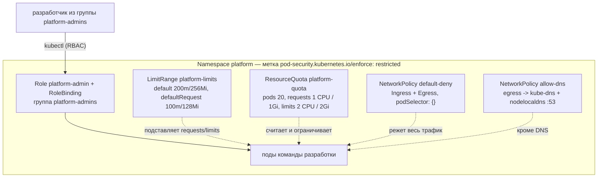

# Project A: Platform Namespace

## Оглавление
<!-- TOC -->
- [Архитектура](#архитектура)
- [Критерии приёмки](#критерии-приёмки)
- [Предварительные требования](#предварительные-требования)
- [Стартовая проверка](#стартовая-проверка)
- [Часть 1: Сборка namespace](#часть-1-сборка-namespace)
  - [Теория для изучения перед частью](#теория-для-изучения-перед-частью)
  - [1.1 Применяем манифесты](#11-применяем-манифесты)
- [Часть 2: Проверяем контракты](#часть-2-проверяем-контракты)
  - [2.1 PSA: небезопасный под не проходит](#21-psa-небезопасный-под-не-проходит)
  - [2.2 LimitRange и ResourceQuota](#22-limitrange-и-resourcequota)
  - [2.3 NetworkPolicy: DNS есть, остальное закрыто](#23-networkpolicy-dns-есть-остальное-закрыто)
  - [2.4 RBAC: кто что может](#24-rbac-кто-что-может)
- [Часть 3: Broken — забытый LimitRange](#часть-3-broken--забытый-limitrange)
- [Аудит-инструмент (`audit/namespace-audit.sh`)](#аудит-инструмент-auditnamespace-auditsh)
- [Проверка](#проверка)
- [Финальная карта ресурсов](#финальная-карта-ресурсов)
- [Теоретические вопросы (итоговые)](#теоретические-вопросы-итоговые)
- [Практические задания (отработка)](#практические-задания-отработка)
- [Чему вы научились](#чему-вы-научились)
- [Уборка](#уборка)
<!-- /TOC -->


> ⏱ время ~30 мин · сложность 2/5 · пререквизиты: Трек 1 (Core), модули 04, 06, 07, 12, 14

Задача проекта — собрать «tenant-namespace» `platform`, в который можно безопасно пустить
команду разработки: с потолком ресурсов, сетевой изоляцией, запретом небезопасных подов и
минимальными правами. Это уменьшенная версия того, что платформенная команда делает для
каждого арендатора кластера; полная версия с несколькими тенантами — Project E.

## Архитектура



## Критерии приёмки

| # | Критерий | Кто проверяет |
|---|---|---|
| 1 | Namespace создан с меткой PSA `enforce: restricted` — root-под отклоняется на admission | `audit`, `verify` |
| 2 | `default-deny` на Ingress **и** Egress с пустым `podSelector` | `audit` |
| 3 | `allow-dns` — иначе после default-deny ни один под не резолвит имена (модуль 15: на стенде DNS идёт через nodelocaldns `169.254.25.10`) | `verify` |
| 4 | `ResourceQuota platform-quota` с потолком по pods, requests и limits | `audit`, `verify` |
| 5 | `LimitRange platform-limits`: под без `resources` получает значения по умолчанию, а не отказ квоты | `audit`, `verify` |
| 6 | `Role platform-admin` + `RoleBinding` на группу `platform-admins`; чужие пользователи и cluster-scope — без прав | `verify` |

## Предварительные требования

```bash
export KUBECONFIG=/root/.kube/kubespray.conf
cd projects/project-a-platform-namespace
```

## Стартовая проверка

```bash
kubectl get nodes
kubectl get ns platform 2>&1 | head -1
# Error from server (NotFound): namespaces "platform" not found   <- чистый старт
```

## Часть 1: Сборка namespace

### Теория для изучения перед частью

- Порядок применения важен: Namespace с меткой PSA должен появиться **до** первого пода —
  метка `enforce` не ретроактивна для уже запущенных подов.
- `ResourceQuota` считает только те поды, у которых заданы `requests`/`limits`; без
  `LimitRange` она превращается в запрет на любой «голый» под (Часть 3).
- `default-deny` в обе стороны — стартовая точка микросегментации; всё, что нужно
  (DNS, доступ к API, трафик между сервисами), потом разрешается явно.

### 1.1 Применяем манифесты

```bash
kubectl apply -f manifests/
kubectl get ns platform --show-labels
# NAME       STATUS   AGE   LABELS
# platform   Active   5s    kubernetes.io/metadata.name=platform,pod-security.kubernetes.io/enforce=restricted,...
kubectl -n platform get resourcequota,limitrange,networkpolicy,role,rolebinding
```

Файлы применяются по алфавиту: `00-namespace.yaml` идёт первым — это и обеспечивает
порядок из теории выше.

## Часть 2: Проверяем контракты

### 2.1 PSA: небезопасный под не проходит

```bash
kubectl -n platform run root-pod --image=nginx:1.27-alpine --restart=Never
# Error from server (Forbidden): pods "root-pod" is forbidden: violates PodSecurity "restricted:latest":
#   allowPrivilegeEscalation != false (...), unrestricted capabilities (...), runAsNonRoot != true (...), seccompProfile (...)
```

Совместимый под — без root, без capabilities, с seccomp:

```bash
kubectl -n platform apply -f - <<'EOF'
apiVersion: v1
kind: Pod
metadata: { name: web, namespace: platform }
spec:
  securityContext:
    runAsNonRoot: true
    seccompProfile: { type: RuntimeDefault }
  containers:
  - name: web
    image: nginxinc/nginx-unprivileged:1.27-alpine
    securityContext:
      allowPrivilegeEscalation: false
      capabilities: { drop: ["ALL"] }
EOF
kubectl -n platform get pod web
```

### 2.2 LimitRange и ResourceQuota

Под `web` создан без `resources` — их подставил LimitRange, а квота их учла:

```bash
kubectl -n platform get pod web -o jsonpath='{.spec.containers[0].resources}{"\n"}'
# {"limits":{"cpu":"200m","memory":"256Mi"},"requests":{"cpu":"100m","memory":"128Mi"}}
kubectl -n platform describe quota platform-quota | grep -E 'requests.cpu|limits.memory'
# requests.cpu     100m   1
# limits.memory    256Mi  2Gi
```

Попробуйте запросить больше квоты (`requests.cpu: "2"`) — ответ будет
`exceeded quota: platform-quota, requested: requests.cpu=2, used: 100m, limited: 1`.

### 2.3 NetworkPolicy: DNS есть, остальное закрыто

```bash
kubectl -n platform exec web -- nslookup kubernetes.default.svc.cluster.local | head -3
# Server:    169.254.25.10  <- nodelocaldns, разрешён allow-dns
kubectl -n platform exec web -- wget -qO- -T 3 http://kubernetes.default.svc.cluster.local 2>&1 | tail -1
# wget: download timed out   <- default-deny режет всё, кроме DNS
```

Разрешать доступ к API-серверу или соседним сервисам — отдельными политиками по
образцу `allow-dns` (модуль 15).

### 2.4 RBAC: кто что может

```bash
kubectl auth can-i create deployments -n platform --as=alice --as-group=platform-admins   # yes
kubectl auth can-i create networkpolicies -n platform --as=alice --as-group=platform-admins # yes
kubectl auth can-i create deployments -n platform --as=bob                                 # no
kubectl auth can-i delete namespaces --as=alice --as-group=platform-admins                 # no
```

Права выданы группе, а не людям: добавление человека в команду — это запись в IdP, а не
новый RoleBinding.

## Часть 3: Broken — забытый LimitRange

```bash
bash broken/01-forgotten-limitrange.sh
# Error from server (Forbidden): ... pods "demo-app" is forbidden: failed quota: platform-quota:
#   must specify limits.cpu for: web; limits.memory for: web; requests.cpu for: web; requests.memory for: web
```

Симптом, с которым приходят разработчики: «квота на 20 подов, у нас один, а нас не пускают».
Причина — квота с `requests`/`limits` требует, чтобы они были у каждого контейнера, а
подставить их некому. Лечение — вернуть LimitRange:

```bash
kubectl apply -f manifests/limitrange.yaml
kubectl -n platform delete pod demo-app --ignore-not-found
bash broken/01-forgotten-limitrange.sh    # теперь pod/demo-app created
```

## Аудит-инструмент (`audit/namespace-audit.sh`)

Четыре проверки, которые платформенная команда гоняет по всем tenant-namespace:
default-deny с пустым `podSelector`, метка PSA `restricted`, наличие квоты и LimitRange.

```bash
bash audit/namespace-audit.sh
# [OK] Default Deny NetworkPolicy активна
# [OK] PSA policy 'restricted' применена к namespace
# [OK] ResourceQuota 'platform-quota' существует
# [OK] LimitRange 'platform-limits' существует
# [SUCCESS] Аудит пройден: namespace platform готов к продуктиву (4/4)
```

## Проверка

```bash
bash verify/verify.sh
```

`verify` идёт дальше аудита: проверяет RBAC через `kubectl auth can-i --as`, реально
пробует создать root-под (ожидает отказ PSA) и совместимый под (ожидает подстановку
`requests.cpu=100m` из LimitRange), затем запускает аудит.

## Финальная карта ресурсов

| Ресурс | Файл | Что демонстрирует |
|---|---|---|
| Namespace `platform` | `manifests/00-namespace.yaml` | PSA `restricted` через метку |
| ResourceQuota `platform-quota` | `manifests/quota.yaml` | потолок ресурсов тенанта |
| LimitRange `platform-limits` | `manifests/limitrange.yaml` | значения по умолчанию для «голых» подов |
| NetworkPolicy `default-deny` | `manifests/netpol-default-deny.yaml` | изоляция по умолчанию |
| NetworkPolicy `allow-dns` | `manifests/netpol-allow-dns.yaml` | единственное разрешение — DNS |
| Role/RoleBinding `platform-admin` | `manifests/role.yaml` | права группе, а не людям |

## Теоретические вопросы (итоговые)

1. Почему метку PSA надо ставить при создании namespace, а не «потом»? Что произойдёт
   с уже запущенным root-подом, если добавить `enforce: restricted` позже?
2. Чем `audit`/`warn` режимы PSA полезны при миграции существующего namespace?
3. Почему квота без LimitRange превращается в запрет? Какие поля LimitRange отвечают
   за `requests`, какие за `limits`?
4. Что сломается в namespace после `default-deny` Egress без `allow-dns`? Почему на
   стенде недостаточно разрешить только поды `kube-dns`?
5. Чем Role отличается от ClusterRole и почему в проекте права выданы группе?

## Практические задания (отработка)

1. Добавьте политику `allow-same-namespace` (Ingress + Egress внутри `platform`) и
   докажите curl'ом, что два пода в namespace видят друг друга, а под из `lab` — нет.
2. Переведите PSA в режим `warn` + `audit` для профиля `restricted` и `enforce: baseline`;
   создайте под с `hostPath` — что ответит API?
3. Урежьте квоту до `pods: "2"` и попробуйте поднять Deployment с `replicas: 3`;
   найдите, где живёт сообщение об отказе (подсказка: не в `kubectl get pods`).
4. Замените RoleBinding на группу `platform-viewers` с ClusterRole `view` и проверьте
   `auth can-i` для чтения и записи.

## Чему вы научились

- Собирать tenant-namespace из пяти контрактов: PSA, квота, LimitRange, сетевая
  изоляция, RBAC — и понимать, что каждый из них ограничивает.
- Видеть, как отсутствие одного контракта (LimitRange, allow-dns) ломает остальное.
- Проверять политики не чтением YAML, а поведением: `auth can-i`, отказ admission,
  подстановка значений, таймаут трафика.

## Уборка

```bash
../../scripts/clean/clean-module.sh projects/project-a-platform-namespace
kubectl delete ns platform --ignore-not-found
```
