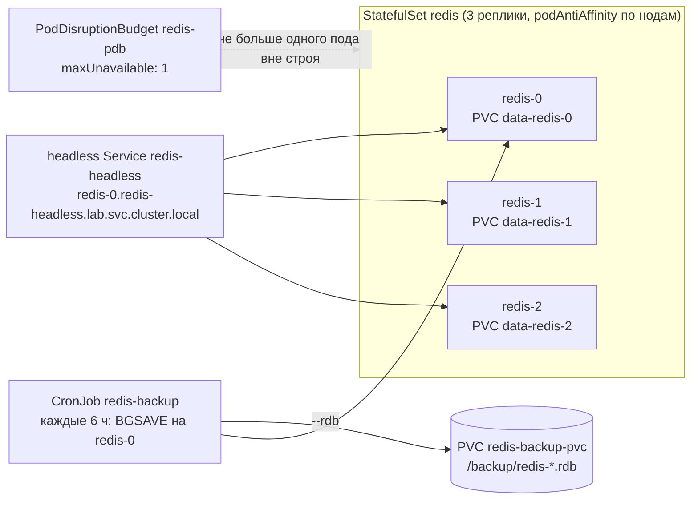

# Project B: Stateful Service (Redis)

## Оглавление
<!-- TOC -->
- [Архитектура](#архитектура)
- [Критерии приёмки](#критерии-приёмки)
- [Предварительные требования](#предварительные-требования)
- [Стартовая проверка](#стартовая-проверка)
- [Часть 1: Развёртывание](#часть-1-развёртывание)
  - [Теория для изучения перед частью](#теория-для-изучения-перед-частью)
  - [1.1 Применяем](#11-применяем)
  - [1.2 DNS-идентичность](#12-dns-идентичность)
- [Часть 2: Данные переживают под](#часть-2-данные-переживают-под)
- [Часть 3: Бэкап](#часть-3-бэкап)
  - [Теория для изучения перед частью](#теория-для-изучения-перед-частью-1)
  - [3.1 Запускаем бэкап вручную](#31-запускаем-бэкап-вручную)
  - [3.2 Убеждаемся, что бэкап живёт отдельно](#32-убеждаемся-что-бэкап-живёт-отдельно)
- [Часть 4: Защита от выселения (PDB)](#часть-4-защита-от-выселения-pdb)
- [Аудит-инструмент (`audit/stateful-audit.sh`)](#аудит-инструмент-auditstateful-auditsh)
- [Проверка](#проверка)
- [Финальная карта ресурсов](#финальная-карта-ресурсов)
- [Теоретические вопросы (итоговые)](#теоретические-вопросы-итоговые)
- [Практические задания (отработка)](#практические-задания-отработка)
- [Чему вы научились](#чему-вы-научились)
- [Уборка](#уборка)
<!-- /TOC -->


> ⏱ время ~35 мин · сложность 3/5 · пререквизиты: Трек 1 (Core), модули 03, 05, 12, 13, 20

<!-- NAV -->
**⬅ [project-a-platform-namespace](../project-a-platform-namespace/)** · [индекс курса](../../README.md) · [карта обучения](../../docs/02-learning-path.md) · **[project-d-production-readiness](../project-d-production-readiness/) ➡**
<!-- /NAV -->

Задача проекта — развернуть stateful-сервис так, как это делают в проде: три экземпляра
Redis с собственным persistent-томом каждый, разнесённые по нодам, защищённые от
одновременного выселения и с регулярным бэкапом на отдельный том. По ходу вы увидите
границу между «данные пережили под» и «данные реплицированы» — это разные вещи.

## Архитектура



Важно: это **три независимых экземпляра** Redis, а не кластер с репликацией — каждый хранит
свои данные. Проект про персистентность, изоляцию и бэкап, а не про HA данных; репликацию
и failover даёт оператор (модуль 21).

## Критерии приёмки

| # | Критерий | Кто проверяет |
|---|---|---|
| 1 | StatefulSet `redis` 3/3 Ready, у каждой реплики свой PVC из `volumeClaimTemplates` (StorageClass `local-path`) | `verify` |
| 2 | Headless Service `redis-headless`: стабильные DNS-имена `redis-N.redis-headless` | `verify` |
| 3 | `podAntiAffinity` по `kubernetes.io/hostname` — на трёхнодовом стенде реплики на разных нодах | `audit` |
| 4 | `PodDisruptionBudget redis-pdb` с `maxUnavailable: 1` | `audit` |
| 5 | Hardened securityContext: non-root, `drop: ALL`, read-only rootfs, seccomp | `verify` |
| 6 | `requests`/`limits` заданы (иначе LimitRange `lab` подставит свои, а квота может не пропустить) | `audit` |
| 7 | CronJob `redis-backup` (`concurrencyPolicy: Forbid`) кладёт RDB в PVC `redis-backup-pvc`, а не в `/tmp` пода | `verify` |

## Предварительные требования

```bash
export KUBECONFIG=/root/.kube/kubespray.conf
cd projects/project-b-stateful-service
kubectl get sc local-path      # default StorageClass стенда
kubectl -n lab describe quota lab-quota | grep requests.cpu   # хватит ли квоты на 3×50m + бэкап
```

## Стартовая проверка

```bash
kubectl -n lab get sts,pvc,cronjob 2>&1 | head -3
# No resources found in lab namespace.   <- чистый старт
```

## Часть 1: Развёртывание

### Теория для изучения перед частью

- StatefulSet даёт **стабильную идентичность**: имя `redis-N`, DNS-имя через headless
  Service и «свой» PVC, который переживает пересоздание пода и переезд на другую ноду
  (для local-path — только на ту же ноду, см. модуль 05).
- Поды создаются по порядку 0 → 1 → 2 (`podManagementPolicy: OrderedReady`), и следующий
  ждёт readiness предыдущего.
- `podAntiAffinity` в режиме `preferred` — планировщик *старается* разнести реплики, но
  на одной ноде не откажет (в отличие от `required`).

### 1.1 Применяем

```bash
kubectl apply -k manifests/
kubectl -n lab get pods -l app=redis -w
# redis-0   0/1   ContainerCreating -> Running 1/1, затем redis-1, затем redis-2
kubectl -n lab get pods -l app=redis -o wide      # NODE — три разные ноды стенда
kubectl -n lab get pvc                             # data-redis-0/1/2 Bound + redis-backup-pvc
kubectl -n lab get pdb redis-pdb                   # ALLOWED DISRUPTIONS 1
```

### 1.2 DNS-идентичность

```bash
kubectl -n lab run redis-cli --rm -it --restart=Never --image=redis:7.2-alpine -- \
  redis-cli -h redis-1.redis-headless.lab.svc.cluster.local PING
# PONG
```

Обычный Service дал бы один VIP на всех; headless возвращает A-записи каждого пода — так
клиент может обратиться к конкретному экземпляру.

## Часть 2: Данные переживают под

```bash
kubectl -n lab exec redis-0 -- redis-cli SET project b
kubectl -n lab exec redis-0 -- redis-cli GET project        # "b"
kubectl -n lab delete pod redis-0
kubectl -n lab wait --for=condition=Ready pod/redis-0 --timeout=120s
kubectl -n lab exec redis-0 -- redis-cli GET project        # "b" — ключ на месте: /data — это PVC
kubectl -n lab exec redis-1 -- redis-cli GET project        # (nil) — у redis-1 свои данные
```

Второй вывод — главный урок части: персистентность ≠ репликация. Потеря диска `redis-0`
означает потерю его ключей, поэтому нужна Часть 3.

## Часть 3: Бэкап

### Теория для изучения перед частью

- `BGSAVE` пишет RDB-снапшот в фоне и не блокирует Redis; синхронный `SAVE` — блокирует.
- Бэкап должен лежать **не** на томе самого сервиса и **не** в эфемерном `/tmp` пода Job'а —
  иначе он умирает вместе с тем, что должен спасать.
- `concurrencyPolicy: Forbid` не даст двум бэкапам наложиться; `successfulJobsHistoryLimit`
  ограничивает мусор из завершённых Job'ов.

### 3.1 Запускаем бэкап вручную

```bash
kubectl -n lab create job --from=cronjob/redis-backup backup-now
kubectl -n lab wait --for=condition=complete job/backup-now --timeout=120s
kubectl -n lab logs job/backup-now
# Triggering BGSAVE on redis-0.redis-headless.lab.svc.cluster.local...
# BGSAVE done at <unix-ts>
# Saved backups in /backup:
# -rw-r--r-- ... /backup/redis-<дата>-<время>.rdb
```

### 3.2 Убеждаемся, что бэкап живёт отдельно

```bash
kubectl -n lab run backup-ls --rm -it --restart=Never --image=busybox:1.36 \
  --overrides='{"spec":{"securityContext":{"runAsUser":999,"runAsNonRoot":true},"containers":[{"name":"ls","image":"busybox:1.36","command":["ls","-lh","/backup"],"volumeMounts":[{"name":"b","mountPath":"/backup"}]}],"volumes":[{"name":"b","persistentVolumeClaim":{"claimName":"redis-backup-pvc"}}]}}'
```

Файл виден из любого пода, смонтировавшего `redis-backup-pvc`, — в проде отсюда его
уносят в S3 (`aws s3 cp`, `mc mirror`) следующим шагом того же Job'а.

## Часть 4: Защита от выселения (PDB)

```bash
kubectl -n lab get pdb redis-pdb
# NAME        MIN AVAILABLE   MAX UNAVAILABLE   ALLOWED DISRUPTIONS   AGE
# redis-pdb   N/A             1                 1                     10m
kubectl -n lab delete pod redis-2 --wait=false; sleep 2
kubectl -n lab get pdb redis-pdb -o jsonpath='{.status.disruptionsAllowed}{"\n"}'
# 0   <- пока redis-2 не Ready, второе выселение (drain соседней ноды) будет отклонено
```

На стенде это проверяется `kubectl drain` двух нод подряд (модуль 10): вторая нода будет
ждать, пока реплика с первой не вернётся в Ready.

## Аудит-инструмент (`audit/stateful-audit.sh`)

```bash
bash audit/stateful-audit.sh
# [OK] Anti-Affinity настроена для подов Redis
# [OK] PodDisruptionBudget 'redis-pdb' существует (maxUnavailable: 1)
# [OK] CronJob 'redis-backup' существует (расписание: 0 */6 * * *)
# [OK] Лимиты ресурсов настроены (memory limit: 512Mi)
# [SUCCESS] Аудит пройден: stateful-сервис готов к продуктиву (4/4)
```

## Проверка

```bash
bash verify/verify.sh
```

`verify` ждёт 3/3 Ready, проверяет PVC каждой реплики, DNS через headless Service,
hardening контейнера, гоняет бэкап-Job и убеждается, что RDB появился на `redis-backup-pvc`,
затем запускает аудит.

## Финальная карта ресурсов

| Ресурс | Файл | Что демонстрирует |
|---|---|---|
| StatefulSet `redis` | `manifests/redis-sts.yaml` | идентичность, PVC на реплику, anti-affinity, hardening |
| Service `redis-headless` | `manifests/redis-svc.yaml` | DNS-имена экземпляров |
| PodDisruptionBudget `redis-pdb` | `manifests/pdb.yaml` | не больше одной реплики вне строя |
| PVC `redis-backup-pvc` + CronJob `redis-backup` | `manifests/backup-cronjob.yaml` | бэкап на отдельный persistent-том |

## Теоретические вопросы (итоговые)

1. Почему у StatefulSet PVC создаются из `volumeClaimTemplates`, а не из общего `volumes`?
   Что произойдёт с PVC при `kubectl delete sts redis`?
2. Чем headless Service отличается от ClusterIP и зачем он StatefulSet'у?
3. `preferred` против `required` podAntiAffinity: что выберете для трёх реплик на трёх нодах и
   почему на двух нодах `required` опасен?
4. Почему `BGSAVE`, а не `SAVE`, и почему бэкап нельзя писать в `/tmp` пода Job'а?
5. Что защищает PDB и от чего он **не** защищает (подсказка: `kubectl delete pod`)?
6. Почему три экземпляра Redis — это не отказоустойчивость данных? Что нужно добавить?

## Практические задания (отработка)

1. Смените `podAntiAffinity` на `required` и масштабируйте StatefulSet до 4 реплик — где
   зависнет четвёртая и что скажет `describe pod`?
2. Уроните ноду с `redis-1` (`kubectl drain`, модуль 10): почему под не переедет и что для
   этого нужно поменять в StorageClass?
3. Добавьте в бэкап-Job шаг ротации: хранить только 5 последних RDB.
4. Сделайте бэкап всех трёх экземпляров, а не только `redis-0` — с помощью Indexed Job
   (модуль 20) или цикла по `redis-N`.
5. Поставьте `restore`-Job: восстановить `redis-0` из последнего RDB на чистый PVC.

## Чему вы научились

- Разворачивать stateful-сервис с идентичностью, persistent-томом на реплику и защитой от
  одновременного выселения.
- Отличать персистентность от репликации и понимать, где заканчивается StatefulSet и
  начинается оператор.
- Строить бэкап так, чтобы он переживал и под, и ноду: асинхронный снапшот + отдельный том.

## Уборка

```bash
../../scripts/clean/clean-module.sh projects/project-b-stateful-service
kubectl -n lab delete pvc -l app=redis --ignore-not-found
kubectl -n lab delete pvc redis-backup-pvc --ignore-not-found
```
