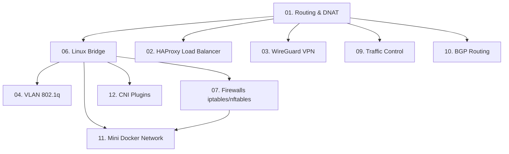

# Linux Networking Labs — Практическое администрирование сетей в Linux

Этот курс посвящен изучению сетевого стека Linux: от базовой маршрутизации и L2-коммутации до виртуальных частных сетей (VPN), BGP-маршрутизации и реализации сетевой изоляции в контейнерах (Docker, CNI).

---

## 🗺 Карта лабораторных работ

Курс состоит из **12 практических работ**, расположенных по возрастанию сложности:

| № | Директория | Тема лабораторной работы | Сложность | Время | Ключевые технологии |
|:-:|---|---|:-:|:-:|---|
| **01** | [`lab01-routing-dnat/`](./lab01-routing-dnat/) | Статическая маршрутизация и DNAT | Легко | 40 мин | `netns`, `veth`, `ip route`, `iptables` |
| **02** | [`lab02_loadbalancer/`](./lab02_loadbalancer/) | Балансировка трафика и отказ | Средне | 45 мин | `HAProxy`, `http.server`, `roundrobin` |
| **03** | [`lab03_wireguard/`](./lab03_wireguard/) | Защищенные VPN-туннели WireGuard | Средне | 50 мин | `WireGuard`, `wg-tools`, `cryptokey` |
| **04** | [`lab04_vlan/`](./lab04_vlan/) | Тегирование трафика (802.1q) | Средне | 60 мин | `VLAN`, `802.1q`, Router-on-a-stick |
| **05** | [`lab05_dns_dhcp/`](./lab05_dns_dhcp/) | Внутренний DNS и DHCP сервер | Легко | 45 мин | `dnsmasq`, `udhcpc`, DHCP DORA |
| **06** | [`lab06_linux_bridge/`](./lab06_linux_bridge/) | Сетевые мосты и изоляция L2 | Средне | 50 мин | `bridge (br0)`, `sysctl`, `MASQUERADE` |
| **07** | [`lab07_ip_nftables/`](./lab07_ip_nftables/) | Фильтрация трафика и Firewalls | Сложно | 90 мин | `iptables`, `nftables`, `conntrack`, `rate limiting` |
| **08** | [`lab08_gcp_cloud_nat/`](./lab08_gcp_cloud_nat/) | Облачный NAT в Google Cloud (GCP) | Средне | 40 мин | GCP VPC, Cloud Router, Cloud NAT |
| **09** | [`lab09_traffic_control/`](./lab09_traffic_control/) | Эмуляция плохой сети (Traffic Control) | Средне | 45 мин | `tc`, `netem` (delay, loss, corruption), `tbf` |
| **10** | [`lab10_bgp/`](./lab10_bgp/) | Динамическая BGP-маршрутизация | Сложно | 75 мин | `BIRD`, `BGP`, `dummy interfaces`, AS |
| **11** | [`lab11_mini_docker/`](./lab11_mini_docker/) | Контейнерная сеть своими руками | Сложно | 80 мин | `namespaces`, `bridge`, `veth`, DNAT |
| **12** | [`lab12_cni_intro/`](./lab12_cni_intro/) | CNI-плагины изнутри (ADD/DEL) | Сложно | 70 мин | `CNI bridge`, `host-local IPAM`, JSON spec |

---

## 📈 Граф зависимостей лаб

Рекомендуется проходить лабораторные работы последовательно. Ниже показаны зависимости между темами (какие лабы закладывают фундамент для последующих):



---

## 💻 Требования к окружению

1. **Операционная система**: Любой современный дистрибутив Linux (рекомендуется Ubuntu 20.04+ / Debian 11+).
2. **Права доступа**: Требуются права суперпользователя (`root`/`sudo`) для создания сетевых пространств имен (`netns`), виртуальных интерфейсов, мостов и модификации правил фильтрации трафика (`iptables`/`nftables`).
3. **Установка пакетов**: Для запуска всех работ установите основные инструменты:
   ```bash
   sudo apt-get update && sudo apt-get install -y \
     iproute2 iptables nftables haproxy wireguard \
     dnsmasq busybox-syslogd bird2 iperf3 tcpdump curl jq dnsutils
   ```
4. **Особые требования**:
   * **Лабораторная работа №8 (GCP Cloud NAT)** выполняется в консоли Google Cloud Platform. Для нее требуется активный GCP-аккаунт. *Внимание: использование облачных ресурсов GCP может быть платным! Не забудьте удалить созданные ресурсы по завершению лабы!*

---

## 🧹 Общие правила уборки

Виртуальные сети создаются в оперативной памяти с использованием Namespaces. Чтобы избежать накопления ненужных процессов и сетевых адаптеров на хосте, в большинстве лабораторных предусмотрен скрипт очистки:
```bash
# Для сброса окружения в папке конкретной лабы
bash cleanup.sh
```
Перед началом новой лабораторной работы рекомендуется выполнить очистку ресурсов предыдущей работы.
