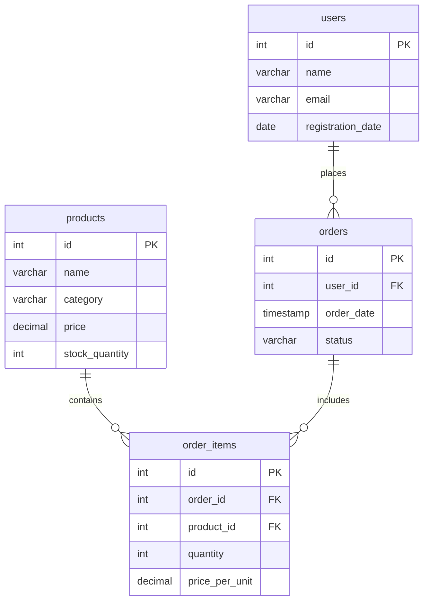

# Базовый курс по SQL (SQL Basics)

Этот курс предназначен для изучения основ языка SQL (Structured Query Language). Все практические задания выполняются в СУБД PostgreSQL, но полученные знания применимы к большинству реляционных баз данных (MySQL, SQLite, Oracle и др.).

## Подготовка стенда (Инициализация БД)

Для выполнения заданий вам потребуется тестовая база данных "Интернет-магазин" (E-commerce).
В корне этого курса находится файл `init.sql`. Запустите его, чтобы создать таблицы и наполнить их тестовыми данными.

**Вариант 1 — Локальный PostgreSQL:**
```bash
sudo -u postgres psql -f init.sql
```

**Вариант 2 — Docker Compose:**
```bash
docker compose up -d
```

Скрипт идемпотентен — его можно запускать повторно для пересоздания данных.

В результате будет создана база данных `shop_db` с таблицами: `users`, `products`, `orders` и `order_items`.

## Схема базы данных (ER Diagram)

Вся практика модулей строится вокруг этой схемы. Она моделирует работу простого интернет-магазина.



## Модули

1. [01-basic-select](modules/01-basic-select) — Основы выборки данных (SELECT, WHERE, ORDER BY, LIMIT).
2. [02-joins](modules/02-joins) — Соединение таблиц (INNER JOIN, LEFT JOIN).
3. [03-aggregations](modules/03-aggregations) — Агрегация данных и группировка (COUNT, SUM, AVG, GROUP BY, HAVING).
4. [04-dml](modules/04-dml) — Управление данными (INSERT, UPDATE, DELETE).

## Структура модуля

- `README.md` — теория и справочный материал;
- `tasks/01-*.md` — базовое задание (по материалам теории);
- `tasks/01-task.md` — продвинутое задание (повышенная сложность);
- `tasks/solution.sql` — решение продвинутого задания;
- `tasks/verify.sh` — скрипт проверки решения;
- `solutions/` — эталонные решения базового задания.
