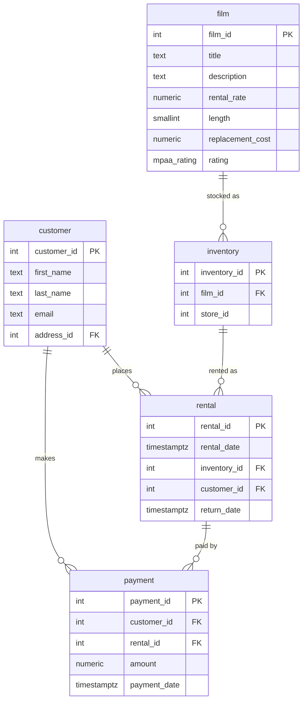

# Базовый курс по SQL (SQL Basics)

Этот курс предназначен для изучения основ языка SQL (Structured Query Language). Все практические задания выполняются в СУБД PostgreSQL, но полученные знания применимы к большинству реляционных баз данных (MySQL, SQLite, Oracle и др.).

## Подготовка стенда (Инициализация БД)

Для выполнения заданий используется учебная база данных **Pagila** — стандартный демонстрационный набор PostgreSQL. Она моделирует прокат видео: фильмы, их экземпляры на складе, аренда клиентами и платежи.
В корне курса лежит дамп `init.sql`. Он содержит только объекты схемы `public` (без `CREATE DATABASE`), поэтому базу `pagila` нужно создать заранее.

**Вариант 1 — Docker Compose (рекомендуется):**
```bash
docker compose up -d
```
Контейнер сам создаёт базу `pagila` (пользователь `postgres`, пароль `secretpassword`, порт `5432`) и при первом запуске прогоняет `init.sql`. Подключение:
```bash
PGPASSWORD=secretpassword psql -h 127.0.0.1 -U postgres -d pagila
```

**Вариант 2 — Локальный PostgreSQL:**
```bash
sudo -u postgres createdb pagila
sudo -u postgres psql -d pagila -f init.sql
```

> ⚠️ Дамп **не идемпотентен**: он не содержит `DROP`/`IF NOT EXISTS`, поэтому повторный прогон в уже наполненную базу завершится ошибками `relation ... already exists`. Чтобы пересоздать данные с нуля, сначала удалите базу (`dropdb pagila` или `docker compose down -v`), затем инициализируйте заново.

В результате будет создана база данных `pagila` с таблицами `film`, `rental`, `customer`, `inventory`, `payment`, `actor`, `category` и др.

## Схема базы данных (ER Diagram)

Практика модулей строится вокруг ядра схемы Pagila. Клиент (`customer`) берёт фильмы в аренду (`rental`); конкретный экземпляр фильма на складе — это `inventory`, который ссылается на сам фильм (`film`); за аренду проходит платёж (`payment`).



## Модули

1. [01-basic-select](modules/01-basic-select) — Основы выборки данных (SELECT, WHERE, ORDER BY, LIMIT).
2. [02-joins](modules/02-joins) — Соединение таблиц (INNER JOIN, LEFT JOIN).
3. [03-aggregations](modules/03-aggregations) — Агрегация данных и группировка (COUNT, SUM, AVG, GROUP BY, HAVING).
4. [04-dml](modules/04-dml) — Управление данными (INSERT, UPDATE, DELETE).
5. [05-indexes](modules/05-indexes) — Индексы и оптимизация запросов (EXPLAIN, EXPLAIN ANALYZE, CREATE INDEX).
6. [06-backups](modules/06-backups) — Резервное копирование и восстановление (pg_dump, pg_restore).


## Структура модуля

- `README.md` — теория и справочный материал;
- `tasks/01-*.md` — базовое задание (по материалам теории);
- `tasks/01-task.md` — продвинутое задание (повышенная сложность);
- `tasks/solution.sql` — решение продвинутого задания;
- `tasks/verify.sh` — скрипт проверки решения;
- `solutions/` — эталонные решения базового задания.
